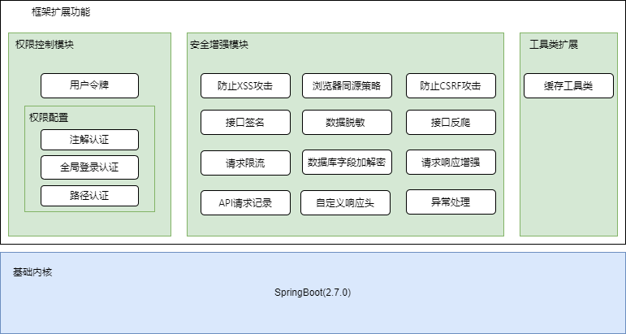

# 基础框架使用手册

## 项目简介

本项目是孵化自公司内部项目的一个企业级服务端的快速开发框架，是一个基于Spring Boot增强并与之完全兼容的框架，提供了权限控制模块、安全增强模块、缓存工具类等，致力于提高开发人员的业务关注度和程序健壮性。该版本基于`Spring Boot 2.7.0` 开发，并兼容 `Spring Cloud`。

## 版本追踪

| 版本号          |备注      |发布时间 |
| -------------- |  ---------------------------- |-------------- |
| 1.0.0          | 最新版本 | 2022-08-10 |
| 1.0.1          | 预发行版本 | 2022-11-10 |

## 框架架构图


<center>架构图</center>


## 引入说明

`gradle.build` 引入仓库

```groovy
 repositories {
        //内网仓库
        maven { url "http://192.168.7.197:8081/repository/maven-public/" }
    }
```

依赖引入

```groovy
implementation 'com.tfswx.proj:newbie-boot-starter:<version>'

# 1.0以上版本，如需使用Redis相关功能请添加以下依赖
implementation  "cn.dev33:sa-token-dao-redis-jackson:1.28.0"
```
## 权限控制模块
> 主要功能：登录认证、权限认证、微服务网关鉴权等一系列权限相关问题

###  1. 用户令牌

#### 功能介绍
令牌（Token）是系统的临时密钥，相当于账户名和密码，用来决定是否允许这次请求和判断这次请求是属于哪一个用户的，它允许你在不提供密码或其他凭证的前提下，访问网络和系统资源

!> 令牌为所有后续权限校验的先决条件和前提

#### 配置说明

| 配置项                                        | 默认值(单位/秒) | 说明                                                         |
| --------------------------------------------- | --------------- | ------------------------------------------------------------ |
| `application.security.token.timeout`          | 30天            | 代表Token的长久有效期，无法继续使用,无法续签，想要继续使用必须重新登录,值配置为-1后，代表永久有效，不会过期 |
| `application.security.token.activity-timeout` | 30分钟          | 代表临时有效期，用户如果一直操作则会一直续签，直到连续30分钟无操作，Token才会过期,值配置为-1后，代表永久有效，不会过期 |


> 长期有效和临时有效的区别
假设你需要登录系统，首先就要办理一个身份标识（要访问系统接口先登录）。
系统为你颁发一个Token，以后每次进出都要带上这个身份标识（后续每次访问系统都要提交 Token）。
系统为这个令牌设定两个过期时间：
> - 第一个是 **timeout**，代表令牌的长久有效期，就是指最长能用多久，假设 timeout=3年，那么3年后此令牌将被系统删除，想要继续来系统办理业务必须重新申请令牌（Token 过期后想要访问系统必须重新登录）。
> - 第二个就是 **activity-timeout**，代表令牌的临时有效期，就是指这个令牌必须每隔多久来系统签到一次，假设 activity-timeout=1月 ，你如果超过1月不来办签到一次，系统就将你的令牌冻结(Token 长期不访问系统，被冻结，但不会被删除）。

!>两个过期策略可以单独配置，也可以同时配置，只要有其中一个有效期超出了范围，这个令牌就会变得不可用（两个有效期只要有一个过期了，Token就无法成功访问系统了）。

?> `UserManager`类说明  
该类是一个用户凭证相关的工具类， 提供框架权限模块的登录、注销、上下文数据的传递、令牌信息的获取等功能。

| 方法                                                         | 参数说明                                                     | 返回值               | 说明                                                         |
| ------------------------------------------------------------ | ------------------------------------------------------------ | -------------------- | ------------------------------------------------------------ |
| ~~public static void login(Object accountId)~~               | `Object accountId` 账号id                                    | --                   | 业务验证通过后标记为登录。<br />1.0版本之后过时。            |
| ~~public static void login(Object accountId,String device)~~ | `Object accountId` 账号id<br/> `String device` 设备标识(用于不同的设备登录) | --                   | 业务验证通过后标记为登录。<br />1.0版本之后过时。            |
| `public static TokenInfo` <br/>`assignToken(Object accountId)` | `String  device` 设备标识(可选，用于不同的设备登录)          | `TokenInfo` 令牌对象 | 标记为登录并签发token。<br />为了消除业务登录与框架登录的语义冲突，推荐改为该方法。<br />1.0版本之后新增。 |
| `public static TokenInfo` <br/>`assignToken(Object accountId,String device)` | `Object accountId` 账号id <br/>`String  device` 设备标识(用于不同的设备登录) | `TokenInfo` 令牌对象 | 标记为登录并签发token。<br />为了消除业务登录与框架登录的语义冲突，推荐改为该方法。<br />1.0版本之后新增。 |
| `public static void destroyToken()`                          | `Object accountId` 账号id                                    | --                   | 销毁令牌。<br />为了消除业务登录与框架登录的语义冲突，推荐改为该方法。<br />1.0版本之后新增。 |
| `public static void`<br/>`destroyToken(Object accountId,String device)` | `Object accountId` 账号id <br/>`String  device` 设备标识(用于不同的设备登录) | --                   | 销毁令牌。<br />为了消除业务登录与框架登录的语义冲突，推荐改为该方法。<br />1.0版本之后新增。 |
| ~~public static void logout()~~                              | `Object accountId` 账号id                                    | --                   | 注销。<br />1.0版本之后过时。                                |
| ~~public static void logout(Object accountId,String device)~~ | `Object accountId` 账号id <br/>`String  device` 设备标识(用于不同的设备登录) | --                   | 注销。<br />1.0版本之后过时。                                |
| `public static <T> void`<br/> `setContext(String key, T data)` | `String key` 键 <br/> `Object data` 任意的对象， 推荐字符串  | --                   | 以键值对的方式设置上下文元数据。<br/>当应用系统需要在令牌中传递一些自定义的数据时，如增加单位编码、单位名称等，使用本方法即可在当前请求上下文间传递。 |

#### 使用示例

```properties
# 代表Token的长久有效期，单位秒，例如将其配置为 30天，代表在30天后，Token必定过期
#无法继续使用,无法续签，想要继续使用必须重新登录,值配置为-1后，代表永久有效，不会过期
application.security.token.timeout= 2592000 
# 代表临时有效期，单位秒，例如将其配置为 1800 (30分钟)，代表用户如果30分钟无操作，
#则此Token会立即过期,如果在30分钟内用户有操作，则会再次续签30分钟，用户如果一直操作则会一直续签，
#直到连续30分钟无操作，Token才会过期,值配置为-1后，代表永久有效，不会过期
application.security.token.activity-timeout=1800
```

**后端示例代码**
```java
    // 模拟登录
    @PostMapping("login")
    public TokenInfo doLogin(UserDTO user) {
        // 模拟用户登录
        if("admin".equals(user.getUsername()) && "123456".equals(user.getPassword())) {
            //首先调用 `UserManager.assignToken(userId)` 分配令牌
            UserManager.assignToken(10000);
            //调用 `UserManager.getTokenInfo()` 
            //返回当前会话的令牌信息，此方法返回一个TokenInfo对象
            TokenInfo tokenInfo = UserManager.getTokenInfo();
            return tokenInfo;
        }
        return null;
    }
```

**返回结果**

```json
{
"tokenName": "tf_token",
"tokenValue": "5a06d54b-2a0a-4e0a-997a-69c3eed50661",
 ...
}
```
?> 其有两个关键属性：`tokenName`和`tokenValue`（token 的名称和 token 的值），前端需要将这两个值保存到浏览器缓存中，每次在请求头中以`tokenName:tokenValue`的方式传递到后端，作为后续请求鉴权的依据。


### 2. 权限配置

#### 功能介绍
 基于RBAC模型实现, 支持公认的安全原则：最小特权原则、责任分离原则和数据抽象原则。  
 认证的方式分为三种： 基于注解、基于登录、 基于路径匹配三种方式。
 主要解决：登录认证、权限认证、微服务网关鉴权等一系列权限相关问题  


#### 配置说明

| 配置项                                     | 默认值 | 说明             |
| ------------------------------------------ | --------------- | ---------------- |
| `application.security.authorize.enabled`   | false           | 是否开启权限认证,关闭后注解无法生效。 |
| `application.security.authorize.auth-type` | --              | 认证类型，<br/>可选配置包括`annotation`(注解认证), `login_check`(全局登录认证), `match_url`(路径认证)。 |
| `application.security.authorize.excludes`  | --              | 需要排除的请求路径， 支持结尾(/**)的路径匹配,自定义静态或者非静态函数,支持组合。 |


#### 使用示例

**`AuthorizationProvider `接口说明**  

!> 1.0版本后该接口分解为两个职责更明确的  
  - 接口`AnnoAuthorizationProvider`(基于注解进行鉴权时候需要实现该接口)
  - 接口`UriPathAuthorizationProvider`(基于请求路径进行鉴权时候需要实现该接口)<br/>
    这两个内部方法定义为`AuthorizationProvider`方法的子集，因此下面不在重复进行说明,  对1.0之前的版本功能做了兼容，不影响之前版本的升级

该类实际上是真正的系统权限的获取入口，按照业务的需求动态的提供适配的权限数据，后续所有的验证都是从此处获取实时的权限校验数据

| 方法 | 参数 |返回值|说明 |备注 |
| ---- |  ---- |---- |---- |---- |
|   List<String> getPermissionList(Object loginId, String loginType) | loginId 登录id（UserManager.login 时传入的值）<br> loginType 登录设备类型(自定义的唯一标识，如app, pc, web等) |  `List<String>`   | 返回一个账号所拥有的权限码集合   |1.0版本后迁移到`AnnoAuthorizationProvider`接口|
|   List<String> getRoleList(Object loginId, String loginType)  |  loginId 登录id（UserManager.login 时传入的值）<br> loginType 登录设备类型 (自定义的唯一标识，如app, pc, web等) |   `List<String>`  |返回一个账号所拥有的角色标识集合   |1.0版本后迁移到`AnnoAuthorizationProvider`接口|
|  List<String> getUrlPatternList(Object loginId, String loginType)|  loginId 登录id（UserManager.login 时传入的值）<br> loginType 登录设备类型 (自定义的唯一标识，如app, pc, web等) |  `List<String>`  |返回一个账号所拥有的可访问的路径集合，支持以/**为后缀的路径匹配规则 |1.0版本后迁移到`UriPathAuthorizationProvider`接口|

```java
@Component
public class MyAuthorizationProvider implements AuthorizationProvider {
    /**
     * 返回一个账号所拥有的权限码集合
     * @param loginId 登录id (就是在进行登录时的 UserManager.login 时传入的值)
     * @param loginType 登录类型
     */
    @Override
    public List<String> getPermissionList(Object loginId, String loginType) {
        // 本list仅做模拟，实际项目中要根据具体业务逻辑来查询权限,

        //由于权限可能随时在变，也可能长时间不变，所以需要业务开发人员按照实际的
        //业务场景自行判断是否需要查库还是进行缓存更新等策略
        List<String> list = new ArrayList<String>();
        /**所有的授权码都是按照项目的实际需求定制规则**/

        // 添加新增用户的授权码
        list.add("user-add");
        // 添加删除用户的授权码
        list.add("user-delete");
          // 添加更新用户的授权码
        list.add("user-update");
         // 添加获取用户的授权码
        list.add("user-get");
         // 添加获取内容的授权码
        list.add("article-get");
        return list;
    }

    /**
     * 返回一个账号所拥有的角色标识集合
     */
    @Override
    public List<String> getRoleList(Object loginId, String loginType) {
        // 本list仅做模拟，实际项目中要根据具体业务逻辑来查询角色

         //由于权限可能随时在变，也可能长时间不变，所以需要业务开发人员按照实际的
        //业务场景自行判断是否需要查库还是进行缓存更新等策略
        List<String> list = new ArrayList<String>();

        // 添加管理员角色
        list.add("admin");
        // 添加超级管理员角色
        list.add("super-admin");
        return list;
    }

     
    //路径认证只需要实现以下接口，返回一个账号所拥有的URLS集合
    @Override
    public List<String> getUrlPatternList(Object loginId, String loginType) {

        //由于权限可能随时在变，也可能长时间不变，所以需要业务开发人员按照实际的
        //业务场景自行判断是否需要查库还是进行缓存更新等策略,此处只做模拟

        final List<String> urls = new ArrayList<>();
        // 支持以/**为后缀的路径匹配规则，例如可访问/zzjg/hello下的所有方法
        urls.add("/zzjg/hello/**");
        //支持精确匹配，例如/zzjg/hello/test1方法
        urls.add("/zzjg/hello/test1");
        return urls;
    }
}
```


#### 2.1 注解认证

##### 功能介绍

注解认证的方式是只对配置注解的方法或者接口进行权限认证

```properties
# 开启
application.security.authorize.enabled==true
# 注解认证
application.security.authorize.auth-type=annotation
```

##### 使用示例


`@Authorize`

?> 登录认证: 使用了该注解的方法或者类，只需要用户登录即可访问

```java
@Authorize                        
@GetMapping("hello")
public String hello() {
    return "hello";
}
```

`@AuthorizeRole`

?> 角色认证:必须具有指定角色标识才能进入该方法，或者是该接口  
> 注解参数:

|   参数   |    说明  |
| ---- | ---- |
|   value   |   需要校验的角色集合   |
|     mode |  验证模式(或Condition.OR，并Condition.AND)    |

```java
// 只有角色为user或者admin的用户才可以操作该controller中方法
@AuthorizeRole(value = {"user","admin"}, mode = Condition.OR)
public class TestController {
    @GetMapping("test")
    public String test() {
        return "hello";
    }
}
// **************************************************
// 只有角色为admin的用户才可以进入该方法
@AuthorizeRole(value = "admin")
@GetMapping("hello")
public String hello() {
    return "hello";
}
```

`@AuthorizePermission`

?> 权限认证：必须具有指定权限才能进入该方法 

> 注解参数:

|   参数   |    说明  |
| ---- | ---- |
|   value   |   需要校验的角色集合   |
|    mode |  验证模式(或Condition.OR，并Condition.AND)    |
|   orRole |  在权限认证不通过时的容错选择，两者只要其一认证成功即可通过校验    |

```java
//代表本次请求只要具有 user-add权限 或 admin角色 其一即可通过校验
@AuthorizePermission(value="user-add", orRole="admin")
// orRole = {"admin", "user"}，具有2个角色其一即可
// orRole = {"admin, user"}，必须2个角色同时具备
@GetMapping("hello")
public String hello() {
    return "hello";
}
```


#### 2.2 全局登录认证

##### 功能介绍

有些场景只需要用户登录后就可以访问系统内所有的接口，该场景下只要用户登录了既可以访问应用内的所有接口，由框架自动进行权限相关的后续操作，开发人员无需关心


##### 使用示例

```properties
# 开启认证
application.security.authorize.enabled=true
# 全局登录认证模式
application.security.authorize.auth-type=login_check
```

#### 2.3 路径认证

##### 功能介绍

有些场景下，不同的用户需要不同的接口访问权限，该场景下需要指定具体路径的访问权限。支持路径前缀鉴权。


##### 使用示例

```properties
# 开启认证
application.security.authorize.enabled==true
# 路径认证模式
application.security.authorize.auth-type=match_url
```


#### 2.4 补充说明
?> 有些场景下需要批量排除某些路径的时候，可以使用以下两种方式支持

1. 注入自定义的`AuthorizeProperties` 类

| 属性     | 说明                                                         |
| -------- | ------------------------------------------------------------ |
| enabled  | 是否启用认证                                                 |
| authType | 认证类型                                                     |
| includes | 匹配URL（多个用逗号分隔）<br/>支持以/**为后缀的路径匹配规则，支持自定义方法，支持组合 |
| excludes | 排除URL（多个用逗号分隔）<br/>支持以/**为后缀的路径匹配规则，支持自定义方法，支持组合 |


```java
@Bean
public AuthorizeProperties authorizeProperties() {
        // 按需定义属性
        enabled = true,
        authType=LOGIN_CHECK,
        includes="自定义的函数等"
        ...
}
```
?> 这种方式适合在框架无法考虑和满足所需要的授权规则的时候，自行进行编码实现自定义规则的场景


2. 通过调用自定义方法（类方法、实例方法均可以）完成定制过滤 
```properties
# 需要排除认证的请求接口，支持以/**为后缀的路径匹配规则，支持自定义方法，支持组合
application.security.authorize.excludes=/yhgl/login,/yhgl/**，com.tfswx.Test.excludes
```
其中`com.tfswx.Test.excludes`为返回一个字符串类型的函数（可以是静态或者非静态）例如
```java
class Test {
  public String excludes() {
      return "api/a, api/b";
    }  
}
```
## 安全增强模块

### 1. 防止`XSS`攻击

#### 功能介绍

 XSS攻击通常指的是通过利用网页开发时留下的漏洞，通过注入恶意指令代码到网页，使用户加载并执行攻击者恶意制造的网页程序  

>**常见行为**
>
>- 盗取Cookie并发送
>- 获取内网ip（攻击内网、扫描内网）
>- 获取浏览器保存的明文密码
>- 截取网页屏幕
>- 网页上的键盘记录

> **应用场景**  
>
> - 重灾区：评论区、留言区、个人信息、订单信息等   
> - 针对型：站内信、网页即时通讯、私信、意见反馈  
> - 存在风险：搜索框、当前目录、图片属性等  

!>默认关闭，添加如下配置打开,目前只支持String类型的请求参数进行`XSS`过滤

####  配置说明

| 配置项                                                       | 默认值 | 说明                  |
| ------------------------------------------------------------ | ------ | --------------------- |
| `application.security.xss.enabled`                           | false  | 是否开启 XSS 功能     |
| `application.security.xss.excludes`                    | --     | 需要排除的请求路径，只支持精确匹配  |
| `application.response.headers.X-Frame-Options`               | --     | 拒绝在iframe显示视图，可选的值有 deny、sameorigin、allow-from https://example.com/  |
| `application.response.headers.X-XSS-Protection` | --     | 启用浏览器默认XSS防护 可选的值有： 0 、1、1;mode=block、1; report=https://example.com/ |


#### 使用示例

```properties
# XSS 配置启用,默认false
application.security.xss.enabled=true
# 排除/yhgl/xss接口的XSS过滤功能
application.security.xss.excludes=/yhgl/xss
# 拒绝在iframe显示视图
application.response.headers.X-Frame-Options=DENY
# 启用浏览器默认XSS防护
application.response.headers.X-XSS-Protection=1; mode=block
```

#### 补充说明
`X-Frame-Options ` 值说明：

| 值 | 说明 |
| ---- | ---- |
|   deny   |   表示该页面不允许在 frame 中展示，即便是在相同域名的页面中嵌套也不允许   |
|  sameorigin    |   表示该页面可以在相同域名页面的 frame 中展示   |
|  allow-from uri    |   表示该页面可以在指定来源的 frame 中展示  |

`X-XSS-Protection` 值说明：

| 值 | 说明 |
| ---- | ---- |
|   0   |   表示禁用 XSS 过滤这个功能   |
|  1    |    表示启用 XSS 过滤 ,如果检测到攻击，将不安全的部分删除 |
|  1; mode=block   |  启用XSS过滤器,如果检测到攻击，直接阻止整个页面的加载  |
| 1; report=uri  |  表示启用 XSS 过滤,如果检测到跨站脚本攻击，浏览器会清除在页面上检测到的不安全的部分，并使用report-uri的POST 一个 XSS 警报。|


### 2. 浏览器的同源策略

#### 功能介绍

浏览器的同源策略用于阻止A网站读取来B网站的资源，资源类型包括cookie、AJAX请求、DOM等。这种机制阻止恶意站点读取另一个站点的数据，同时也支持一些有效请求。<br>
> **场景说明：** 例如运行在 https://domain-a.com 的 JavaScript 代码使用 XMLHttpRequest 来发起一个到 https://domain-b.com/data.json 的请求。
出于安全性，浏览器限制脚本内发起的跨源 HTTP 请求。例如，XMLHttpRequest 和 Fetch API 遵循同源策略。这意味着使用这些 API 的 Web 应用程序只能从加载应用程序的同一个域请求 HTTP 资源，除非响应报文包含了正确 CORS 响应头。

?> CORS(跨站资源共享)需要浏览器和服务器同时支持。目前，所有浏览器都支持该功能。<br>
对于开发者来说，CORS 通信与普通的 AJAX 通信没有差别，代码完全一样。浏览器一旦发现 AJAX 请求跨域，就会自动添加一些附加的头信息，有时还会多出一次附加的请求，但用户不会有感知。因此，实现 CORS 通信的关键是服务器。框架已经内置实现了CORS 接口。

####  配置说明

| 配置项                                        | 默认值 | 说明                                 |
| --------------------------------------------- | ------ | ------------------------------------ |
| `application.security.cors.enabled`           | false  | 是否开启CORS功能，true为开启，false为关闭                     |
| `application.security.cors.path-pattern`      | /**    | 允许跨域的接口地址，指定的路径模式启用跨域请求处理。 默认为所有请求路径，支持精确路径映射 URI(例如{"/admin"})作为 以及 Ant 风格的路径模式（例如 {"/admin/**"}） |
| `application.security.cors.allowed-origins`   | *      | 接受请求的域名 ,默认允许所有来源                     |
| `application.security.cors.allowed-methods`   | *      | 接受请求的方式，默认允许所有请求方式 ，多个以逗号分隔，"*"代表允许所有的请求方法。例如:GET,POST,PUT等                     |
| `application.security.cors.allowed-headers`   | *      | 设置在实际请求期间允许的header列表，默认为所有的头     |
| `application.security.cors.exposed-headers`   | --     |设置的请求期间不允许的header列，此属性不支持"*"，默认不设置  |
| `application.security.cors.max-age`           | 1800   | 用来指定本次预检请求的有效期，单位为秒。默认30分钟，即允许缓存该条回应1800秒（即30分钟），在此期间，不用发出另一条预检请求。           |
| `application.security.cors.allow-credentials` | true   | 是否支持用户凭据 ，Access-Control-Allow-Credentials响应报头指示的响应是否可以暴露于该页面。当true值返回时它可以暴露。凭证是 Cookie ，授权标头或 TLS 客户端证书 |

#### 使用示例

```properties
# 启用cors，值是一个布尔值
application.security.cors.enabled=true
# 设置允许跨域的接口地址，/**代表所有地址，默认/**
application.security.cors.path-pattern=/**
# 表示接受任意域名的请求, 默认是"*"
application.security.cors.allowed-origins=*
# 设置允许跨域的请求方式，例如:GET,POST,PUT等，多个以逗号分隔，"*"代表允许所有的请求方法，默认：GET,HEAD,POST
application.security.cors.allowed-methods=GET,HEAD,POST
# 设置在实际请求期间允许的header列表，"*"代表允许所有的头，默认允许所有的头
application.security.cors.allowed-headers=*
# 配置Access-Control-Expose-Headers, 此属性不支持"*"，默认不设置
application.security.cors.exposed-headers=
#用来指定本次预检请求的有效期，单位为秒。默认30分钟，即允许缓存该条回应1800秒（即30分钟），在此期间，不用发出另一条预检请
application.security.cors.max-age=1800
# 支持用户凭据 ，Access-Control-Allow-Credentials响应报头指示的请求的响应是否可以暴露于该页面。当true值返回时它可以暴露。凭证是 Cookie ，授权标头或 TLS 客户端证书
application.security.cors.allow-credentials=true
```


### 3. 防止`CSRF`攻击

#### 功能介绍

跨站请求伪造（CSRF）是一种冒充受信任用户，向服务器发送非法请求的攻击方式。

> **场景说明：**
> 例如，以下非预期请求可能是通过在跳转链接后的 URL 中加入恶意参数来完成：
> ```
> 
> ```
> 对于在 `https://www.example.com` 有权限的用户，这个  标签会在他们根本注意不到的情况下对 `https://www.example.com` 执行这个操作，即使这个标签根本不在 `https://www.example.com` 内。

增删改的接口参数值都有规律可循，可以被人恶意构造增删改接口  
将恶意构造的增删改接口发给对应特定用户，让特定用户点击  
特定用户使用自己的认证信息对该接口发起了请求，可能被新增危险信息(比如管理员账号)，修改敏感信息(比如退款金额)，删除关键信息(比如删除差评)

#### 使用示例

开启接口签名功能自动防止该问题，见后续`接口签名`章节


### 4. 接口签名

#### 功能介绍

接口签名解决以下几个场景的接口安全问题，通过框架内置的拦截器自动对参数进行校验，开发人员无需关注。

1. 请求是否合法：是否是我规定的那个人
2. 请求是否被篡改：是否被第三方劫持并篡改参数
3. 防止重复请求（防重放）：是否重复请求
4. 预防`CSRF`攻击


####  配置说明

| 配置项                                                | 默认值 | 说明                 |
| ----------------------------------------------------- | ------ | -------------------- |
| `application.security.tampering.enabled`              | false  | 是否开启接口签名功能 |
| `application.security.tampering.includes`             | /**    | 需要进行签名验证的请求路径，支持/**结尾的路径规则，多个路径可使用逗号分隔     |
| `application.security.tampering.excludes`             | *      | 需要排除签名验证的请求路径，支持/**结尾的路径规则，多个路径可使用逗号分隔  |
| `application.security.tampering.private-key-filename` | --     | 用于解密签名值的私钥文件地址，需要和前端的公钥匹配         |


#### 使用示例

```properties
# 私钥地址
application.security.tampering.private-key-filename=d:/rsa_private_key.pem
# 是否启用接口签证，默认false
application.security.tampering.enabled=true
# 需要进行签名验证的请求路径，默认/**
application.security.tampering.includes=/**
# 排除签名验证的请求路径
application.security.tampering.excludes=/yhgl/xss
```

**前端部分配合调整示例**

以下以nuxt服务端请求为例进行说明

1. `nuxt.config.js`中添加`axios` 插件

```js
  plugins: [
    { src: '~/plugins/axios', mode: 'server' }
  ]
```

2. 编写插件 `axios.js`

```javascript
import { v4 } from 'uuid'
import crypto,{ createHash } from 'crypto'
import { _ } from "lodash"
const fs = require('fs')
export default function ({ $axios }) {
    $axios.onRequest(config => {
      // 添加时间戳，基于毫秒的时间戳
      config.headers['timestamp'] = Date.now()
      // 添加唯一标识,随机值
      config.headers['nonce'] = v4()
      // 获取headers头参数  
      let headers = config.headers
       // 获取params参数  
      let params = config.params
      // 合并参数
      let input = Object.assign(params, headers)
      let sorted = _(input).toPairs().orderBy([0], ['asc']).fromPairs().value()
      // 签名,将所有参数进行序列化后，按照ASCII码排序，获取16进制的`md5`值，让后使用后端的公钥对`md5`进行`RAS`加密后的值    
      let sign = createHash('md5').update(JSON.stringify(sorted).replace(/"/g, "")).digest('hex')
      const public_key = fs.readFileSync('公钥绝对地址', 'utf8');
      const encryptStr = crypto.publicEncrypt({key: public_key, padding: crypto.constants.RSA_PKCS1_PADDING}, Buffer.from(sign,'utf8'))
      config.headers['sign'] = encryptStr.toString('base64')
    })
  }

```

?> 前端提交到后端必要参数  

| 参数       | 说明                                                         |
| ---------- | ------------------------------------------------------------ |
| 请求Id   [`nonce`]  | 前端定义的随机值，用于唯一确定一次有效请求 |
| 用户令牌   [`token`] | 用户令牌中的token值     |
| 时间戳    [`timestamp`] | 当前请求的时间戳，防止在短时间内的重复请求 |
| 接口签名值 [`sign`]| 由以上几个元素结合参数等自定义的条件算法生成的加密值，用于校验接口是否被篡改过 |


!> **说明:**   以上参数可以放在`url`, `body`，`header`中的任何地方, 但是按照支付宝和腾讯的惯例， 一般除去token以外的，get都在url中传参，post的都在body中包含

#### 补充说明

?> 有些场景下需要批量排除某些路径的时候，可以使用以下两种方式支持

1. 自行注入`TamperingProperties` Bean

?> 这种方式适合在框架无法考虑和满足你所需要的授权规则的时候，自行进行编码实现自定义规则的场景

`TamperingProperties`类为接口签名所属的配置类

| 属性               | 说明                      |
| ------------------ | ------------------------- |
| enabled            | 是否启用认证              |
| privateKeyFilename | 认证的私钥文件            |
| includes           | 匹配URL（多个用逗号分隔） |
| excludes           | 排除URL（多个用逗号分隔） |

```java
@Bean
public TamperingProperties tamperingProperties() {
        // 按需定义属性后注入
        enabled = true,
        privateKeyFilename="私钥文件全路径",
        includes="自定义的函数等"
        ...
}
```
?> 这种方式适合在框架无法考虑和满足所需要的授权规则的时候，自行进行编码实现自定义规则的场景


2. 通过调用自定义的（类方法、实例方法均可以）完成定制过滤  
```properties
# 需要排除认证的请求接口，支持以/**为后缀的路径匹配规则，支持组合
application.security.tampering.excludes=/yhgl/login,/yhgl/**，com.tfswx.Test.excludes
```
其中`com.tfswx.Test.excludes`为返回一个字符串类型的函数（可以是静态或者非静态）例如
```java
class Test {
  public String excludes() {
      return "api/a, api/b";
    }  
}
```


### 5.数据脱敏 

#### 功能介绍

数据脱敏是对某些敏感信息通过脱敏规则进行数据的变形，实现敏感隐私数据的可靠保护。在涉及客户安全数据或者一些敏感数据的情况下，需要进行数据脱敏。

?>基础框架v1.0.1版本以后支持数据脱敏功能

#### 参数说明

 `@Sensitive` 数据脱敏注解，可以作用在类和字段上

| 参数    | 说明                                                         |
| ------- | ------------------------------------------------------------ |
| value   | `MaskType`类型，打码替换类型，默认为`Name`                        |
| pattern | 当需要自定义替换内容或者扩展少数民族姓名等不常见的字段时使用的正则表达式 默认`无`  |
| symbol  | 用于替换原有敏感信息的符号，默认`*`                          |

 `value`内置支持的`MaskType`类型

| 类型       | 说明                                                         |
| ---------- | ------------------------------------------------------------ |
| `Name`     | 姓名，默认为中文，当非中文或者少数民族姓名时候可以指定pattern，`例如 刘位元 替换为 刘**` |
| `IdCard`   | 中国居民身份证，  `例如 620111200002011234 替换为 ****11200002011*** ` |
| `Tel`      | 手机号或者座机号(要求带区号)， `例如028-12345678  替换为  028-***678 ` |
| `BankCard` | 银行卡，`例如12345678901111  替换为  ****567890***      `    |
| `Email`    | 邮箱， `例如saiweixun@163.com 替换为  s*****@163.com   `     |
| `Password` | 密码 ，`例如：123456 替换为 ******  `                        |
| `Custom`   | 自定义替换规则,用于处理不常见的敏感数据                      |

#### 使用示例

```java
@Data
@ApiModel("用户信息")
public class UserInfo {
    @ApiModelProperty("人员编码")
    private String rybm;

    @Sensitive(value = MaskType.Name)
    @ApiModelProperty("人员名称")
    private String rymc;

    @Sensitive(MaskType.Tel)
    @ApiModelProperty("电话")
    private String tel;

    @Sensitive(MaskType.IdCard)
    @ApiModelProperty("身份证")
    private String cardId;

    @Sensitive(MaskType.Password)
    @ApiModelProperty("密码")
    private String password;
}
```

```json
输出效果
{
  "code": 0,
  "message": "成功",
  "data": {
    "rybm": "12345678",
    "rymc": "王阳明",
    "tel": "093*********",
    "cardId": "12345*************78",
    "password": "******"
  }
}
```

假设遇到例如`萨达姆.侯赛因`等少数名族语言可以按照自己的需求指定替换规则

```java
  // 此处的正则表达式为少数民族中文翻译名称的匹配模式，如框架内置未考虑到的类型，可以自行查阅正则表达式编写
  @Sensitive(value = MaskType.Name, pattern = "(?<=[\\u3400-\\u9fa5 \\.]{3})[\\u3400-\\u9fa5](?=[\\u3400-\\u9fa5]{1})")
  @ApiModelProperty("人员名称")
  private String rymc;

  # 输出效果
  萨达姆.**因
```


### 6. 接口反爬

#### 功能介绍
 阻止外部系统利用爬虫等工具获取系统的数据。

#### 使用示例
由于基于基础框架所有的请求都会验签、鉴权、或者自定义限流模式，所以通过常规方式进行接口访问是无效的，也就是说只有破解了参数加密算法或者获取到用户名和账号才可以进行合法访问，同时也可以对IP进行限制。

详见 [权限控制模块](http://192.168.7.43:8080/#/tec/cbf?id=权限控制模块)、[接口签名](http://192.168.7.43:8080/#/tec/cbf?id=_4-接口签名)、[请求限流](http://192.168.7.43:8080/#/tec/cbf?id=_7-请求限流)

### 7. 请求限流

#### 功能介绍

通过对一个时间窗口内的请求量进行限制，来保障系统的正常运行。 如果我们的服务资源有限、处理能力有限，就需要对调用请求进行限制，以防止自身服务由于资源耗尽而停止服务。

限流的**两个概念**

|   术语  |  说明   |
| ---- | ---- |
|  阈值    |   在一个单位时间内允许的请求量。 如 QPS 限制为10，说明 1 秒内最多接受 10 次请求。   |
|  拒绝策略    |  超过阈值的请求的拒绝策略，常见的拒绝策略有直接拒绝、排队等待等    |


目前支持以下限流模式


| 限流模式                                | 说明                     |
| -------------------------------------- | ------------------------ |
| `IP` | 按照IP进行限制 |
| `URL` | 按照URL进行限制,即只按照请求路径进行限流 |
| `IP_AND_URL` | 按照IP和请求URL进行限制 |
| `USER` | 按照用户令牌进行限制, 兼容之前版本的`USER_TOKEN` |

#### 配置说明

| 配置项                                              | 默认值 | 说明                                     |
| --------------------------------------------------- | ------ | ---------------------------------------- |
| `application.security.ratelimit.enabled`            | false  | 是否启用限流                             |
| `application.security.ratelimit.local`              | --     | true为本地模式，false为使用redis        |
| `application.security.ratelimit.cache-maximum-size` | --     | 本地内存淘汰队列阈值大小，如果使用local模式需要按实际情况配置            |
| `application.security.ratelimit.cache-duration`     | 18000 | 缓存有效周期，默认30分钟                            |
| `application.security.ratelimit.rate-limit-type`    | IP     | 限流模式                                 |
| `application.security.ratelimit.threshold`          | --     | 限流阈值，需要和`application.security.ratelimit.duration`配合使用 |
| `application.security.ratelimit.duration`           | 单位秒     | 限流的计算时间周期，即一个限流的参考时间单元，需要和`application.security.ratelimit.threshold`配合使用                     |

#### 使用示例

```properties
# 是否启用限流
application.security.ratelimit.enabled=true
# 是否使用本地内存
application.security.ratelimit.local=true
# 本地内存淘汰队列阈值大小
application.security.ratelimit.cache-maximum-size=10000
# 缓存时间
application.security.ratelimit.cache-duration=1
# 限流模式
application.security.ratelimit.rate-limit-type=url
# 限流阈值
application.security.ratelimit.threshold=3
# 限流的计算时间单元
application.security.ratelimit.duration=10
```


### 8.数据库字段加解密

#### 功能介绍

 有些场景为了保证数据存储安全，需要对数据库表字段的数据进行加密，即存储在数据库中的数据为密文，系统界面展示的时候为明文，目前支持String类型字段加解密操作。

#### 配置说明

| 配置项                                     | 默认值 | 说明                                                         |
| ------------------------------------------ | ------ | ------------------------------------------------------------ |
| `application.security.mybatis.enabled`     | false  | 是否启用数据库字段加解密                                     |
| `application.security.mybatis.public-key`  | --     | 非对称加密公钥，与`application.security.mybatis.private-key`成对出现 |
| `application.security.mybatis.private-key` | --     | 非对称加密私钥 ，与`application.security.mybatis.public-key`成对出现 |


 `SecretData` 数据库字段加解密，可作用在类或者字段上

>|   参数   | 说明     |
>| ---- | ---- |
>|  ignored    |  忽略加密，仅在字段上使用有效。<br/>场景：在类上添加加密注解后，可以对不需要加密的字段进行配置  |

`SecureManager`接口说明

?>内置实现了一个默认的【RSA】非对称加解密的实现，需要配置上述的公钥和私钥  

|   方法 | 参数  |返回值 | 说明     |
| ---- | ---- | ---- |---- |
|  String encrypt(String value)   |  value   需要加密的值 |  加密后的值|  自定义加密方法  |
|  String decrypt(String value)   | value    需要解密的值 | 解密后的值 | 自定义解密方法  |

!> 当开发人员自定义实现后，即可自动替换框架内置的加解密算法

####  使用示例

1. 添加配置

```properties
# 启用数据库字段加解密
application.security.mybatis.enabled=true
```

2. 自定义加密算法

```java
// 1.实现SecureManager接口后,无需其它操作。直接`@SecretData`使用注解即可
@Component
public class CustomSecureManager implements SecureManager {

    // 2.实现数据加密方法
    @SneakyThrows
    @Override
    public String encrypt(String value) {
        return Base62.encode(value);
    }

    // 3.实现数据解密方法
    @SneakyThrows
    @Override
    public String decrypt(String value) {
        return Base62.decodeStr(value);
    }
}
```

3. 使用注解

```java
// Entity 基类
@Data
public class Entity {
    private String crcs;
    // 只对该字段加密
    @SecretData
    private String cwxx;
    // 只支持String类型，因此处未Date类型所以字段不会进行加密
    // @SecretData
    private Date cjsj;

    @TableId(type = IdType.AUTO)
    private Long id;
}

// Sub 类
@Data
public class Sub {
    private String crcs;
    // 只对该字段加密
    @SecretData
    private String cwxx;
}

// ListSub 类
@Data
public class ListSub {
    private String crcs;
    // 只对该字段加密
    @SecretData
    private String cwxx;
}


@Data
@TableName(value = "t_rz_yx", autoResultMap = true)
// 在类上配置该注解，可以开启当前类中所有String类型的字段进行加密
@SecretData
public class RzYx extends Entity {

    private String rznr;
    private String ipdz;
    // 由于当前类中所有String类型开启加密,此处忽略该字段不进行加密
    @SecretData(ignored = true)
    private String ystoken;
    private String yhxx;
    private String dydz;

    // 会对Sub类中的cwxx加密
    @TableField(typeHandler = FastjsonTypeHandler.class)
    private Sub map;
    
    // 会对ListSub类中cwxx加密
    @TableField(typeHandler = FastjsonTypeHandler.class)
    private List<ListSub> list;
}
```


!> 注意事项:  
1、不可以对加密字段进行`like`模糊查询，但是支持`=`查询。  
2、如果在基类上配置了加密注解，该注解不会传导到子类上！  
3、加解密注解对于`入参对象`与`出参对象`需要成对出现，否则无法进行正常的解析，即加密存储到数据库的数据在获取的时候还需要解密。


### 9.请求响应增强

#### 功能介绍

默认`Springboot`并不会处理参数空白的情况，一般都是由前端就行截取，后端进行校验。但是某些情况下如果出现开发不规范，就会留下一些莫名其妙的bug，因此框架对字符串类型进行了自动处理，诸如`你好   `会自动处理为`你好`， 同时在相应阶段也按照约定返回统一格式的包装类，但是开发人员仅需要按照实际的情况返回即可

- 所有输入的参数无需自己处理空白字符，无需手动`trim()`
- 框架会自动包裹需要返回的对象，所以只需要直接放回原始对象即可。

#### 使用示例

```java
 @GetMapping("/get")
 public User get() {
   User user = new User();
   user.setName("小强");
   return user;
 }
```

返回

```json
{
"code": 0,
"message": "成功",
"data": {
    "name": "小强"
  }
}
```


### 10. `API`请求记录

#### 功能介绍

在提供接口调用时，通常需要对接口调用情况进行记录以便问题追踪和排查,统计分析等。


#### 配置说明

| 配置项                                          | 默认值 | 说明                   |
| ----------------------------------------------- | ------ | ---------------------- |
| `application.request.logging`                   | false  | 是否开启请求日志记录       |
| `application.response.logging`                   | false  | 是否开启响应日志记录       |
| `application.response.detail-exception-enabled` | false  | 前端是否显示堆栈异常信息 |

`ReqResService` 类是请求响应的拦截器，开发人员可以在这里

?> 可以按业务的需求，实现一个或者多个接口方法即可

| 方法  | 参数 |返回值|说明     |
| ---- | ----|---- |---- |
|  void request(HttpServletRequest httpServletRequest, Object body)   |httpServletRequest 请求上下文 <br> o 请求对象 | --   | API请求记录处理  |
|  void response(HttpServletRequest httpServletRequest, HttpServletResponse httpServletResponse,Object body)   | httpServletRequest 请求上下文  <br/>httpServletResponse 响应上下文 <br> o 请求对象象   |--| API响应记录处理|
| void record(LogMetaData logMetaData, HttpServletRequest httpServletRequest, HttpServletResponse httpServletResponse)|logMeta 请求响应记录对象 <br>  httpServletRequest 请求上下文  <br/> httpServletResponse 响应上下文 | --|API请求与响应记录处理|

####  使用示例

```properties
# 开启请求日志拦截
application.request.logging=true
# 开启响应日志拦截
application.response.logging=true
# true 前端返回详细异常【堆栈信息】， false 均显示为【系统异常】
application.response.detail-exception-enabled=true
```

> 考虑到框架包装对象不一定满足业务需求，所有将`请求【HttpServletRequest】和响应【HttpServletResponse】`的对象返回给业务，由业务方在不满足条件的情况下自定义扩展

```java
@Service
public class ReqResServiceImpl implements ReqResService {
    @Override
    public void request(HttpServletRequest httpServletRequest, Object o) {
        //模拟按业务需求入库，审计等操作
        System.out.println(o);
    }

    @Override
    public void response(HttpServletRequest httpServletRequest, HttpServletResponse httpServletResponse, Object o) {
         //模拟按业务需求入库，审计等操作
        System.out.println(o);
    }
}
```

#### 补充(since v1.0.1)

为了进一步简化，新增无需添加任何配置, 提供全局统一的日志记录

!> 该方法有别于上面2个方法，为字节码增强方式实现,需要修改入口类`SpringApplication`为`SpringPlusApplication`（框架自定义的增强启动入口类）

```java
@Service
public class ReqResServiceImpl implements ReqResService {

    /**
       API请求出入口
     */
    @Override
    public void record(LogMetaData logMeta, HttpServletRequest httpServletRequest, HttpServletResponse httpServletResponse) {
         //模拟按业务需求入库，审计等操作
        log.info("{}", JSONUtil.parse(logMeta));
    }
}

@SpringBootApplication
public class Application  {

    public static void main(String[] args) {
        // SpringApplication改为SpringPlusApplication
       SpringPlusApplication.run(Application.class);
    }
}
```


### 11. 自定义响应头

#### 功能介绍

某些业务系统在安保政策下需要对header头进行预处理，而需要预处理哪些header头无法事先了解，例如统一添加系统标识、统一添加一些浏览器相关的安全标识等，系统需要统一的对所有接口的Header头做处理，所以框架提供了自定义扩展header头的配置，即`application.response.headers`

####  使用示例
只需要再`application.response.headers.`后追加自定义的`header`头信息即可   

例如:  
注入`X-Frame-Options` = `DENY`

```properties
application.response.headers.X-Frame-Options=DENY
```
注入 `X-XSS-Protection=1; mode=block`

```properties
application.response.headers.X-XSS-Protection=1; mode=block
```


###  12. 异常处理

#### 功能介绍

在 Web 开发中, 我们经常会需要处理各种异常, 这是一件棘手的事情, 对于很多人来说, 可能对异常处理有以下几个问题:  
- 什么时候需要捕获(try-catch)异常, 什么时候需要抛出(throws)异常到上层.  
- 在 dao 层捕获还是在 service 捕获, 还是在 controller 层捕获.  
- 抛出异常后要怎么处理. 怎么返回给页面错误信息  

#### `StatusCode`内置状态

```java
    SUCCESS(0, "成功"),
    SYSTEM_ERROR(-1, "系统异常，请稍后重试"),
    USER_NOT_LOGIN(10000, "用户名未登录"),
    UNSIGN(10001, "签名验证失败"),
    AUTHORIZE_EXPIRED(10002, "签名过期"),
    PARAM_IS_INVALID(10003, "参数无效"),
    USER_HAS_EXISTED(10004, "用户名已存在"),
    USER_NOT_FIND(10005, "用户名不存在"),
    UNAUTHORIZED(10006, "鉴权失败"),
    NOSIGNPARAMS(10007, "缺少必要的签证参数"),
    NOTFOUNDRESOURCE(10008, "无效的请求,URL不存在");
```


#### 使用示例

可以直接使用静态方法`ErrorResult.info` 等方法返回，也支持`new BusinessException`的返回方式  
```java
  thorw new BusinessException("异常") 
  在框架中等价于
  return ErrorResult.info("异常")
```

**ErrorResult类方法说明**

|  方法    |  参数说明    |
| ---- | ---- |
| info(String message)   | 自定义异常信息|
| info(Integer code, String message,Throwable e)|自定义状态码,异常信息, 异常|
| info(StatusCode resultCode, Throwable e)   |内置状态, 异常  |

**BusinessException类方法说明**

|  方法    |  参数说明    |
| ---- | ---- |
|BusinessException(Object enumObject) | 自定义异常对象|
|BusinessException(Integer code, String message)|自定义状态码,异常信息|
|BusinessException(StatusCode resultCode, Throwable e)   |内置状态, 异常  |


**如何自定义异常对象**  

!> 可以是类也可以是枚举，只要包含`code`和 `message` 属性即可
使用方法

```java
  throw new BusinessException(MyStatusCodeEnum.SYSTEM_ERROR1);

  # MyStatusCodeEnum 定义如下
  public enum MyStatusCodeEnum {
    /**
     * 成功状态码
     */
    SYSTEM_ERROR1(10, "发生了异常1"),
    SYSTEM_ERROR2(21, "发生了异常2");

    private final Integer code;
    private final String message;


    MyStatusCodeEnum (Integer code, String message) {
        this.code = code;
        this.message = message;
    }

    public Integer getCode() {
        return code;
    }

    public String getMessage() {
        return message;
    }
}
```


## 工具类

### 缓存工具类

#### 功能介绍

缓存能够有效地加速应用的读写速度，同时也可以降低后端负载，对日常应用的开发至关重要。

#### 使用方法

> `Spring cache`为我们提供的操作`redis`缓存也有许多限制。例如，无法单独设置缓存值的有效期、无法设置不缓存方法的返回值、无法缓存方法中生成的中间值等。因此框架提供了定制的`RedisService`实现。

`RedisService` 是对Redis的常用方法的开箱即用的封装

**接口说明**


[接口说明](../_media/redis/com/newbie/core/redis/RedisService.html ':include :type=html')

**使用方法**

```java

// 注入后直接使用即可
 @Autowired
 private RedisService redisService;

 // 例如删除一个key
 redisService.del('key')
```

然后直接调用对应的方法即可

## 常见问题

### 1. 如何排除Redis相关功能
由于该框架初期按照有`redis`的场景设计，因此内部已经集成了`redis`相关的依赖，目前不考虑维护2个版本【有redis和无redis的基础框架版本】进行，如果编码的方式排除自动装配类需要多个类一起排除，因此提供以下简单的处理方式

?> 1.0版本以及之前的版本解决方案，1.0以后的版本不存在该问题

```java    

implementation ('com.tfswx.proj:newbie-boot-starter:最新版本') {
  exclude (module: 'sa-token-dao-redis-jackson')
}

```


### 2.引入基础框架后无法进行单元测试

?> 原因说明：本错误只发生在1.0版本单元测试的时候，由于内部的资源文件无法在测试单元内自动复制过去，引发以下错误（**1.0+的版本已经修复该问题**）。

```
Caused by: java.io.FileNotFoundException: Could not open ServletContext resource [/swagger_fix.poperties]
```

?> 解决方案
> **在main文件夹下创建一个`webapp`的文件夹，在`webapp`文件夹中再创建一个`swagger_fix.poperties`文件**

