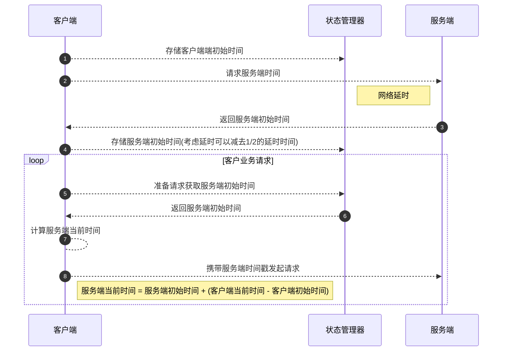

# 基础框架使用手册


<center>架构图</center>


## 基础框架引入说明

`gradle.build` 引入仓库

```groovy
 repositories {
        maven { url "http://192.168.7.197:8081/repository/maven-public/" }
        maven { url "http://192.168.7.197:8081/repository/maven-snapshots/" }
    }
```

添加配置

```groovy
configurations.all {
    resolutionStrategy.cacheChangingModulesFor 0, "seconds"
}
```

依赖引入

```groovy
implementation 'com.tfswx.proj:newbie-boot-starter:2.0.0-SNAPSHOT'
```


# 安全增强

!> **安全相关改造说明**

> 提前说明： 
>
> 为什么拦截器需要显示注入？
>
> 因为有些项目并不需要对应的功能，所以提供业务选择性的显示注入


## 一、用户登录

### 1、token配置

```properties
# 代表Token的长久有效期，单位/秒，例如将其配置为 30天，代表在30天后，Token必定过期，无法继续使用,无法续签，想要继续使用必须重新登录,值配置为-1后，代表永久有效，不会过期
application.security.token.timeout= 2592000 
# 代表临时有效期，单位/秒，例如将其配置为 1800 (30分钟)，代表用户如果30分钟无操作，则此Token会立即过期,如果在30分钟内用户有操作，则会再次续签30分钟，用户如果一直操作则会一直续签，直到连续30分钟无操作，Token才会过期,值配置为-1后，代表永久有效，不会过期
application.security.token.activity-timeout=1800
```

!> **补充** 有时候可能像全局拦截进行处理，而不想加注解，可以如下配置

```properties
# true 返回前端细异常【默认】， false 均现实为 系统异常
application.response.detail-exception-enabled=true

# 开启全局权限验证，定制权限需要关闭, 默认关闭
application.security.global-auth-enabled=true
```


###  2、后端将 token 返回到前端

```java
    @PostMapping("login")
    public TokenInfo doLogin(UserDTO user) {
        // 此处仅作模拟示例，真实项目需要从数据库中查询数据进行比对
        if("admin".equals(user.getUsername()) && "123456".equals(user.getPassword())) {
            UserManager.login(10000);
            return UserManager.getTokenInfo();
        }
        return null;
    }
```

1. 首先调用 `UserManager.login(userId)` 进行登录

2. 调用 `UserManager.getTokenInfo()` 返回当前会话的token详细参数

- 此方法返回一个对象，其有两个关键属性：`tokenName`和`tokenValue`（token 的名称和 token 的值）
- 将此对象传递到前台，让前端人员将这两个值保存到本地

```json
{
"tokenName": "tf_token",
"tokenValue": "5a06d54b-2a0a-4e0a-997a-69c3eed50661",
"isLogin": true,
"loginId": "10000",
"loginType": "login",
"tokenTimeout": 2591999,
"sessionTimeout": 2591999,
"tokenSessionTimeout": -2,
"tokenActivityTimeout": -1,
"loginDevice": "default-device",
"tag": null
}
```

### 3、前端提交到后端必要参数

      1. 将 `token` 塞到请求`header`里 ，格式为：`{tokenName: tokenValue}`

!> 注：如果使用swagger进行接口调试，可以在`文档管理`下的`全局参数设置`中添加全局参数


## 二、权限配置

> 认证的方式分为三种

```properties
# 注解认证 可以指定到用户的角色以及用户的操作权限等
application.security.authorize.auth-type=annotation
# 登录认证 只判断发起当前请求的用户是否登录
application.security.authorize.auth-type=login_check
# 路径认证 判断当前用于是否有操作当前路径的权限
application.security.authorize.auth-type=match_url
```


### 1、注解认证

> **注解认证的方式是只对配置注解的方法或者接口进行权限认证**


#### 实现权限提供器

> 需按照项目的实际情况实现`AuthorizationProvider` 接口
>
> -  `getPermissionList`  返回一个账号所拥有的权限码集合
> -  `getRoleList ` 返回一个账号所拥有的角色标识集合 (权限与角色可分开校验)

```java
@Component
public class XTAuthorizationProvider implements AuthorizationProvider {
    /**
     * 返回一个账号所拥有的权限码集合
     * @param loginId 登录id (就是在进行登录时的 UserManager.login 时传入的值)
     */
    @Override
    public List<String> getPermissionList(Object loginId, String loginType) {
        // 本list仅做模拟，实际项目中要根据具体业务逻辑来查询权限
        List<String> list = new ArrayList<String>();
        list.add("user-add");
        list.add("user-delete");
        list.add("user-update");
        list.add("user-get");
        list.add("article-get");
        return list;
    }

    /**
     * 返回一个账号所拥有的角色标识集合
     */
    @Override
    public List<String> getRoleList(Object loginId, String loginType) {
        // 本list仅做模拟，实际项目中要根据具体业务逻辑来查询角色
        List<String> list = new ArrayList<String>();
        list.add("admin");
        list.add("super-admin");
        return list;
    }
    
    /**
     * 返回一个账号所拥有的URLS集合
     */
    @Override
    public List<String> getUrlPatternList(Object loginId, String loginType) {
        final List<String> urls = new ArrayList<>();
        return urls;
    }
    
}
```


#### 注册注解权限拦截器

```properties
# 开启
application.security.authorize.enabled==true
# 注解认证
application.security.authorize.auth-type=annotation
# 排除某些接口的鉴权测试
application.security.authorize.excludes=/yhgl/login,/yhgl/xss
```


#### 使用示例

#####  `@Authorize`

> 登录认证：只有登录之后才能进入该方法 

```java
@Authorize                        
@GetMapping("hello")
public String hello() {
    return "hello";
}
```

##### `@AuthorizeRole`

> 必须具有指定角色标识才能进入该方法，或者是该接口
>
> - `value`  需要校验的角色集合
> - `mode` 验证模式(或，并)

```java
// 只有角色为user或者admin的用户才可以操作该controller中方法
@AuthorizeRole(value = {"user","admin"}, mode = Condition.OR)
public class TestController {
    @GetMapping("test")
    public String test() {
        return "hello";
    }
}
-----------------------------------------------------------------
// 只有角色为admin的用户才可以进行该方法
@AuthorizeRole(value = "admin")
@GetMapping("hello")
public String hello() {
    return "hello";
}
```

#####  `@AuthorizePermission`

> 权限认证：必须具有指定权限才能进入该方法 
>
> - `value`  需要校验的权限码
> - `mode` 验证模式(或，并)
> - `orRole`  在权限认证不通过时的容错选择，两者只要其一认证成功即可通过校验

```java
//代表本次请求只要具有 user-add权限 或 admin角色 其一即可通过校验
@AuthorizePermission(value="user-add", orRole="admin")
// orRole = {"admin", "user"}，具有2个角色其一即可
// orRole = {"admin, user"}，必须2个角色同时具备
@GetMapping("hello")
public String hello() {
    return "hello";
}
```


### 2、登录认证

#### 注册注解权限拦截器

```properties
# 开启
application.security.authorize.enabled==true
# 注解认证
application.security.authorize.auth-type=login_check
# 排除某些接口的鉴权测试
application.security.authorize.excludes=/yhgl/login,/yhgl/xss
```


### 3、路径认证

#### 注册注解权限拦截器

```properties
# 开启
application.security.authorize.enabled==true
# 注解认证
application.security.authorize.auth-type=match_url
# 排除某些接口的鉴权测试
application.security.authorize.excludes=/yhgl/login,/yhgl/xss
```


#### 实现权限提供器

> 需按照项目的实际情况实现`AuthorizationProvider` 接口
>
> -  `getUrlPatternList`  返回一个账号所拥有的URL集合

```java
@Component
public class XTAuthorizationProvider implements AuthorizationProvider {

    @Override
    public List<String> getPermissionList(Object loginId, String loginType) {
        List<String> list = new ArrayList<String>();
        return list;
    }

    @Override
    public List<String> getRoleList(Object loginId, String loginType) {
        List<String> list = new ArrayList<String>();
        return list;
    }
    
     /**
     * 返回一个账号所拥有的URLS集合
     */
    @Override
    public List<String> getUrlPatternList(Object loginId, String loginType) {
        final List<String> urls = new ArrayList<>();
        // 支持通配符
        urls.add("/zzjg/hello/**");
        //支持精确匹配
        urls.add("/zzjg/hello/test1");
        return urls;
    }
}
```


!> **如果`excludes`需要定制暂时可以使用以下两种方式支持**

```java
// 方式1 注入AuthorizeProperties Bean
@Bean
public AuthorizeProperties authorizeProperties() {
        // TODO
}
-------------------------------------------------------
// 方式2 
application.security.authorize.excludes=FUNC:com.tfswx.Test.excludes
# 其中com.tfswx.Test.excludes为返回一个字符串类型的函数例如
class Test {
  public String excludes() {
      return "api/a, api/b";
  }  
}
```


### 

## 三、防止`XSS`攻击

> 默认关闭，添加如下配置打开

```properties
# XSS 配置启用,默认false
application.security.xss.enabled=true
# 排除/yhgl/xss接口的XSS过滤功能
application.security.xss.excludes=/yhgl/xss
# 拒绝在iframe显示视图
application.response.headers.X-Frame-Options=DENY
# 启用浏览器默认XSS防护
application.response.headers.X-XSS-Protection=1; mode=block
# 禁用浏览器内容嗅探 
application.response.headers.X-Content-Type-Options=nosniff
```

!> 注:目前不支持array与map类型的请求参数进行`XSS`过滤


## 四、 `CORS`(跨站资源共享)支持配置

```properties
# 必选。启用cors，值是一个布尔值
application.security.cors.enabled=true
# 可选。设置允许跨域的接口地址，/**代表所有地址，默认/**
application.security.cors.path-pattern=/**
# 可选。"*"，表示接受任意域名的请求, 默认是"*"
application.security.cors.allowed-origins=*
# 可选。(重要)设置允许跨域的请求方式，例如:GET,POST,PUT等，多个以逗号分隔，"*"代表允许所有的请求方法，默认：GET,HEAD,POST
application.security.cors.allowed-methods=GET,HEAD,POST
# 可选。配置Access-Control-Allow-Headers, "*"代表允许所有的头，默认允许所有的头
application.security.cors.allowed-headers=*
# 可选。配置Access-Control-Expose-Headers, 此属性不支持"*"，默认不设置
application.security.cors.exposed-headers=
# 可选。配置Access-Control-Max-Age, 默认1800秒
application.security.cors.max-age=1800
# 可选。配置Access-Control-Allow-Credentials, 默认true
application.security.cors.allow-credentials=true
```


## 五、防止`CSRF`攻击

> **支持，无需配置**


## 六、接口签名

###  1、后端配置私钥路径

```properties
# 私钥
application.security.tampering.private-key-filename=d:/rsa_private_key.pem
```

###  2.、设置拦截器

```properties
# 是否启用接口签证，默认false
application.security.tampering.enabled=true
# 那些接口需要签证，默认/**
application.security.tampering.includes=/**
# 那些接口需要排除签证
application.security.tampering.excludes=/yhgl/xss
```

> **注：**
>
> 如果在开启接口签名后，需要使用swagger进行接口测试，则需要排除`/public.key`,并且设置token的名称为tf_token
>
> >  `/public.key`是公钥地址;
> >
> > 目前swagger只支持所有参数类型的GET请求、**body参数**类型的POST请求、**路径参数**类型的POST请求、**body参数加表单参数**类型的POST请求


!> 如果`excludes`需要定制暂时可以使用以下两种方式支持

```java
// 方式1 TamperingProperties Bean
@Bean
public TamperingProperties tamperingProperties() {
        // TODO
}
------------------------------------------------------------------
// 方式2 
application.security.tampering.excludes=FUNC:com.tfswx.Test.excludes
# 其中com.tfswx.Test.excludes为返回一个字符串类型的函数例如
class Test {
  public String excludes() {
      return "api/a, api/b";
  }  
}
```


### 3、前端配置

#### 3.1  `nuxt.config.js`

```js
  plugins: [
    { src: '~/plugins/axios', mode: 'server' }
  ],

```


#### 3.2 编写插件 `axios.js`

```javascript
import { v4 } from 'uuid'
import crypto,{ createHash } from 'crypto'
import { _ } from "lodash"
const fs = require('fs')
export default function ({ $axios }) {
    $axios.onRequest(config => {
      // 添加时间戳
      config.headers['timestamp'] = Date.now()
      // 添加唯一标识
      config.headers['nonce'] = v4()
      // 获取headers头参数  
      let headers = config.headers
       // 获取params参数  
      let params = config.params
      // 合并参数
      let input = Object.assign(params, headers)
      let sorted = _(input).toPairs().orderBy([0], ['asc']).fromPairs().value()
      // 签名
      let sign = createHash('md5').update(JSON.stringify(sorted).replace(/"/g, "")).digest('hex')
      const public_key = fs.readFileSync('公钥绝对地址', 'utf8');
      const encryptStr = crypto.publicEncrypt({key: public_key, padding: crypto.constants.RSA_PKCS1_PADDING}, Buffer.from(sign,'utf8'))
      config.headers['sign'] = encryptStr.toString('base64')
    })
  }
```


#### 3.3 前端提交到后端必要参数

   1. `sign`  

      将参数 除去`sign` 以外的所有参数进行序列化后，按照ASCII码排序，获取16进制的`md5`值，让后使用后端的公钥对`md5`进行`RAS`加密后的值

   2. `timestamp`

      基于毫秒的时间戳

   3. `nonce`  随机值 

      前端传递  `uuid`

> 说明以上参数可以放在`url`, `body`，`header`中的任何地方, 但是按照支付宝和腾讯的惯例， 一般除去token以外的，get都在url中传参，post的都在body中包含


## 七、防盗链 

由存储接口支持


## 八、 接口反爬虫

由于基于基础框架所有的请求都会验签，所以单纯的通过规则进行接口访问是无效的，可以理解为天然支持反爬虫


## 九、 限流策略

```properties
# 是否启用限流
application.security.ratelimit.enabled=true
# 是否使用本地内存
application.security.ratelimit.local=true
# 本地内存淘汰队列阈值大小
application.security.ratelimit.cache-maximum-size=10000
# 缓存阈值
application.security.ratelimit.cache-time-unit=days
# 缓存有效周期
application.security.ratelimit.cache-duration=1
# 限流模式
application.security.ratelimit.rate-limit-type=url
# 限流阈值
application.security.ratelimit.threshold=3
# 限流的时间单元
application.security.ratelimit.duration=10
```


# 通用功能

  ## 一、 入参参数说明

所有输入的参数无需自己处理空白字符，无需手动`trim()`


## 二、出参参数说明

框架会自动包裹需要返回的对象，所以只需要直接放回原始对象即可。

```java
 @GetMapping("/get")
 public String get() {
   return "get is ok";
 }
```

返回

```json
{
"code": 0,
"message": "成功",
"data": "get is ok"
}
```


## 三、请求日志

### 1、配置

```properties
# 开启请求日志拦截
application.request.logging=true
# 开启响应日志拦截
application.response.logging=true
```

### 2、请求响应服务接口

> 考虑到框架包装对象不一定满足业务需求，所有将请求和响应的对象返回给业务，由业务方直接自定义拿去和存储

```java
@Service
public class ReqResServiceImpl implements ReqResService {
    @Override
    public void request(HttpServletRequest httpServletRequest, Object o) {
        System.out.println(o);
    }

    @Override
    public void response(HttpServletRequest httpServletRequest, HttpServletResponse httpServletResponse, Object o) {
        System.out.println(o);
    }
}
```


## 四、自定义添加响应头

> 由于很多安全相关或者设计相关的header头是无法预期的，所以框架提供了按需配置键值对的入口

例如注入`X-Frame-Options`和`X-XSS-Protection`

```properties
application.response.headers.X-Frame-Options=DENY
application.response.headers.X-XSS-Protection=1; mode=block
```

or

```properties
application:
  response:
    headers:
      X-Frame-Options: DENY
      X-XSS-Protection: 1; mode=block
```


## 五、系统内置状态码
```java
    SUCCESS(0, "成功"),
    SYSTEM_ERROR(-1, "系统异常，请稍后重试"),
    USER_NOT_LOGIN(10000, "用户名未登录"),
    UNSIGN(10001, "签名验证失败"),
    AUTHORIZE_EXPIRED(10002, "签名过期,已刷新"),
    PARAM_IS_INVALID(10003, "参数无效"),
    USER_HAS_EXISTED(10004, "用户名已存在"),
    USER_NOT_FIND(10005, "用户名不存在"),
    UNAUTHORIZED(10006, "鉴权失败"),
    NOSIGNPARAMS(10007, "缺少必要的签证参数"),
    NOTFOUNDRESOURCE(10008, "无效的请求,URL不存在");
```


## 六、自定义业务异常枚举对象
!> 理论上可以是类也可以是枚举，只要包含`code`和 `message` 属性即可
使用方法
```java
  throw new BusinessException(Status2CodeEnum.SUCCESS);

  public enum Status2CodeEnum {
    /**
     * 成功状态码
     */
    SUCCESS(10, "XXXXXXXXXXX"),
    SYSTEM_ERROR(21, "YYYYYYYY");

    private final Integer code;
    private final String message;


    Status2CodeEnum(Integer code, String message) {
        this.code = code;
        this.message = message;
    }

    public Integer getCode() {
        return code;
    }

    public String getMessage() {
        return message;
    }
}
```


## 七、 说明

开发模式下可以先不开启防止参数篡改 和 重放攻击 及接口幂功能，防止测试不便


## 八、 业务异常
可以直接使用静态方法`ErrorResult.info` 等方法返回，也支持`new BusinessException`的返回方式  
如需自定义异常枚举或者类可以看 [5.2 自定义业务异常枚举对象](#id=六、自定义业务异常枚举对象)


# 缓存

## 一、 内置缓存

> 简单业务直接使用`spring`内置的注解即可，下面分别介绍一下

### 1.1、 `@Cacheable`

> `@Cacheable`可以标记在一个方法上，也可以标记在一个类上。当标记在一个方法上时表示该方法是支持缓存的，当标记在一个类上时则表示该类所有的方法都是支持缓存的
>
> - `value`: value属性是必须指定的，其表示当前方法的返回值是会被缓存在哪个Cache上的，对应Cache的名称。其可以是一个Cache也可以是多个Cache，当需要指定多个Cache时其是一个数组

```java
 @Cacheable(key="'user:'+#id")
  public User find(Integer id) {
     retur nnull;
  }
  # 等价于
  @Cacheable(key="'user:'+ #user.id")
   public User find(User user) {
      return null;
   }
```

> 以下是spring支持使用#root获取的属性，但是为了可读性不建议使用，只做说明
>
> | 属性名称    | 描述                        | 示例                 |
> | ----------- | --------------------------- | -------------------- |
> | methodName  | 当前方法名                  | #root.methodName     |
> | method      | 当前方法                    | #root.method.name    |
> | target      | 当前被调用的对象            | #root.target         |
> | targetClass | 当前被调用的对象的class     | #root.targetClass    |
> | args        | 当前方法参数组成的数组      | #root.args[0]        |
> | caches      | 当前被调用的方法使用的Cache | #root.caches[0].name |


### 1.2、  `@CachePut`

> `@CachePut`标注的方法在执行前不会去检查缓存中是否存在之前执行过的结果，而是每次都会执行该方法，并将执行结果以键值对的形式存入指定的缓存中

```java	
   @CachePut(key = "'user:'+#user.id")
    @Override
    public int update(Long id, User user) {
        //TODO: update user
    }
```

### 1.3、  `@CacheEvict`

>  `@CacheEvict`是用来标注在需要清除缓存元素的方法或类上的。当标记在一个类上时表示其中所有的方法的执行都会触发缓存的清除操作。

```java
    @CacheEvict(key = "'user:'+#user.id")
    @Override
    public int delete(Long id) {
        //TODO: delete user
    }
```

## 二、 自定义缓存

> `Spring cache`为我们提供的操作`redis`缓存也有许多限制。例如，如果我们想单独设置缓存值的有效期，我们不想缓存方法的返回值。如果我们要缓存方法中生成的中间值等，所以框架也提供了`RedisService`进行定制化功能，一般可以不优先使用，只有再有必要的情况下使用。

####  `RedisService`

> 其中包含了基本常见的redis操作类型的接口，直接注入即可使用

使用方法

```java
 @Autowired
 private RedisService redisService;
```

然后直接调用对应的方法即可

# 前端静态化方案

 ## 一、原理


##  二、 使用方法

### 2.1 安装`nginx`与`purge`

2.1.1.下载并解压`nginx`

```
wget http://nginx.org/download/nginx-1.9.9.tar.gz
tar -xvf nginx-1.9.9.tar.gz
```

2.1.2.下载并解压purge

```
wget http://labs.frickle.com/files/ngx_cache_purge-2.3.tar.gz
tar -xvf ngx_cache_purge-2.3.tar.gz
```

2.1.3.若原来有安装`nginx`，需记录`nginx`原来的配置参数`configure arguments`

```
nginx -V
```


2.1.4. 在`nginx-1.9.9/`下重新编译`nginx`，并加上purge模块

```shell
./configure --prefix=/etc/nginx....(原有参数)  --add-module=../ngx_cache_purge-2.3（新加purge模块，填写下载解压的purge模块地址）

make && make install
```

### 2.2 配置

#### 2.2.1 创建缓存路径

> 路径自定义，与下文配置的路径对应即可

```shell
mkdir -p /data/nginx-cache #缓存路径
mkdir -p /data/nginx-temp #自定义存放缓存临时文件路径
```

#### 2.2.2 `nginx`配置缓存空间

```shell
# 修改nginx.conf文件，在http中添加：
proxy_cache_path /data/nginx-cache levels=1:2 keys_zone=nginx-cache:20m max_size=50g use_temp_path=off inactive=168h;  
proxy_temp_path  /data/nginx-temp; #缓存临时路径配置，默认不适用，也不建议使用
```

#### 2.3.3 `proxy_cache`配置

```properties
# 修改nginx.conf文件，新增server
server {
        listen       8083;
        server_name  localhost;

        location ~ / {
            add_header Nginx-Cache $upstream_cache_status;
            proxy_pass http://192.168.1.167:8000;
            proxy_cache nginx-cache;
            proxy_cache_key $host$uri$is_args$args;
            proxy_cache_valid 1m;
        }
}
```

#### 2.3.4  `purge`配置

```properties
# 修改nginx.conf文件，新增server或在已有server中通过路径配置purge
server {
        listen       8084;
        server_name  localhost;
        location / {
            proxy_cache_purge nginx-cache $host$uri$is_args$args;
        }
}
```

#### 2.3.5 重载`nginx`配置即可

## 三、注意事项和扩展

1.  如需使用post请求时，`url`相同body不同，需在`proxy_cache_key`中配置$request_body项；

2. 大量数据造成缓存磁盘空间用尽的解决方法：

- 磁盘占满时会根据`lru`删除旧缓存；
- 可根据缓存磁盘中的文件层级关系进行扩展存储：第一层路径默认为0-f，可将其挂载到不同的存储来扩展存储。

- 多磁盘解决方案：不需要组RAID，按磁盘配置多个proxy_cache_path，使用`nginx`的`split_clients`进行负载均衡。

```
# 我们假设每块硬盘挂载在相应的目录中：/mnt/disk1、/mnt/disk2、/mnt/disk3
proxy_cache_path /mnt/disk1 levels=1:2 keys_zone=cache_1:256m max_size=1024G use_temp_path=off;
proxy_cache_path /mnt/disk2 levels=1:2 keys_zone=cache_2:256m max_size=1024G use_temp_path=off;
proxy_cache_path /mnt/disk3 levels=1:2 keys_zone=cache_3:256m max_size=1024G use_temp_path=off;

split_clients $request_uri $disk {
    33.3%     1;
    33.3%     2;
    *         3;
}

location / {
    proxy_pass http://backend;
    proxy_cache_key $request_uri;
    proxy_cache cache_$disk;
}
```

- 可使用配置`tmpfs`优化缓存存取速度。

## 性能表现

使用ab对nuxt.js的某一页面请求：

|          | 10台主机/1000次请求 | 100台主机/10000次请求 |
| -------- | ------------------- | --------------------- |
| 无缓存   | 共6.4s完成响应      | 共60.9完成响应        |
| 开启缓存 | 共2s完成响应        | 共19.9s完成响应       |


# 常见问题

## 1. 如何排除Redis相关功能

```java
application.redis.enabled=false      
implementation ('com.tfswx.proj:newbie-boot-starter:2.0.0-SNAPSHOT') {
  exclude (module: 'sa-token-dao-redis-jackson')
}

# or

@SpringBootApplication(exclude = {
        RedisAutoConfiguration.class,
        RedisRepositoriesAutoConfiguration.class,
        SaTokenDaoRedisJackson.class
})
```

### 2.客户端同步服务端时间方案

**场景说明**
在客户端开发中，往往会有一些功能对时间要求比较严格，客户端需要获取到当前最准确的时间。但由于客户端环境多种多样，我们无法保证直接在客户端设备上获取到的时间是最准确的时间。
对于某些问题设备来说，设备时间与比当前实际的时间差了几个小时，甚至几天的情况都存在。倘若某功能依赖于当前时间，而客户端所提供的时间不准，就往往会给客户造成一些困扰。

>  如果是`nuxt.js`等服务端框架，这个问题就不存在
>
>  所以重点说的就是非服务端渲染框架如何同步时间

?> 解决方案


