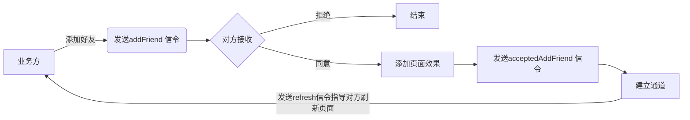
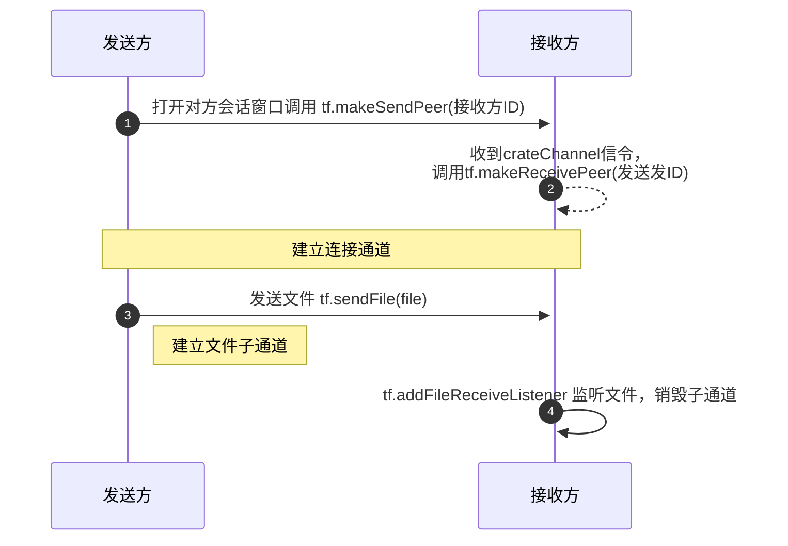
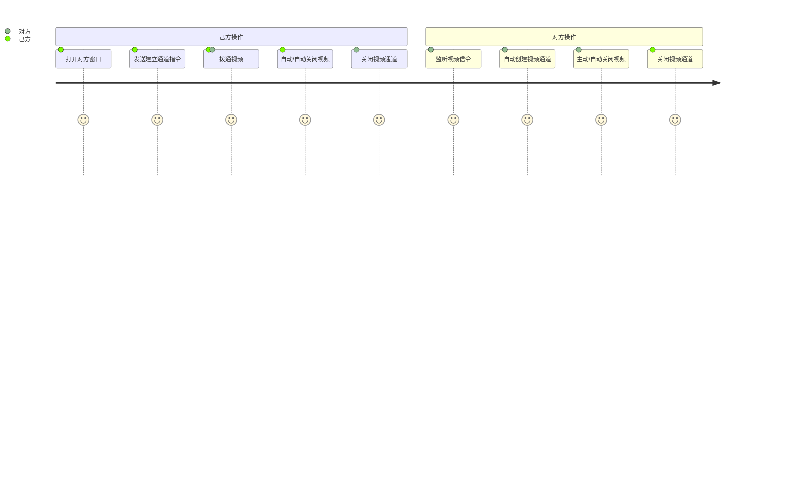
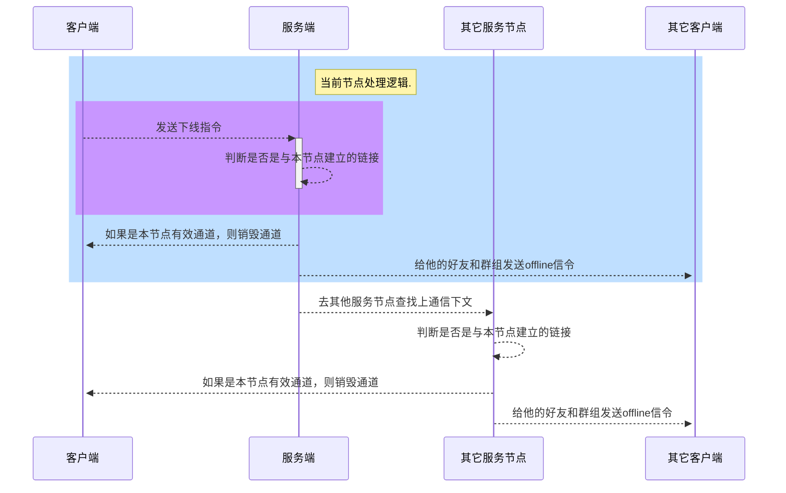

# 即时通讯SDK使用文档

[TOC]


## 1. 前端引用

!> 前端提供两个版本，分别支持ES5, javascript
前置条件，设置`npm`或者`yarn`的 registry`http://192.168.7.197:8081/repository/npm-group/`
如: 
```
  npm config set registry http://192.168.7.197:8081/repository/npm-group/
  or
  yarn config set registry http://192.168.7.197:8081/repository/npm-group/
```
 >
> 版本对应为：
>
> `swx-im-ts` ts 版本
>
> `swx-im-js` js 版本

### 1.1 使用步骤
#### 1.1.1 安装依赖
```
npm install swx-im-ts@0.0.3
or
yarn add swx-im-ts@0.0.3
```
#### 1.1.2 初始化TFScoket对象

##### 1.1.2.1 参数说明

| 字段                | 类型     | 默认值      | 说明                                                         |
| ------------------- | -------- | ----------- | ------------------------------------------------------------ |
| protocol            | string   | ws          | 协议 wss or ws <br/>ws 和 wss 均为 WebSocket 协议的 schema，一个是非安全的(端口80)，一个是安全(端口443)的                                          |
| ip                  | string   | localhost   | 服务端ip                                                     |
| port                | number   | 9326        | 服务器端口                                                   |
| isManualOffline     | boolean  | false       | 是否主动下线,一般不需要操作                                  |
| navParam            | string   |             | 加在ws url后面的请求参数，形如：name=张三&id=12，用来定位参数 |
| userPrefix | string | user_ | 用户前缀 |
| groupPrefix | string | group_ | 房间前缀 |
| businessParam       | string   |             | 业务参数,一般不建议使用，因为他也会附加在url上,可以通过消息体传递 |
| reconnInterval      | number   | 1000        | 重连间隔时间 单位：毫秒                                      |
| binaryType          | string   | blob | BinaryType   arraybuffer/blob                                |
| heartbeatTimeout    | number   | 1000 * 60   | 心跳时间 单位：毫秒                                          |
| lastInteractionTime | array    |             | 重连间隔时间                                                 |
| handler             | function |             | 消息处理器                                                   |

##### 1.1.2.2 方法说明

| 方法名                          | 入参         | 说明                                                     |
| ------------------------------- | ------------ | -------------------------------------------------------- |
| connect(isReconnect: boolean)   | 是否支持重连 | 建立连接                                                 |
| send(msg: Message)              | Message对象  | 发送数据                                                 |
| reconnect()                     |              | 重连，框架一般自动调用                                   |
| ping()                          |              | 用于心跳检查                                             |
| close(isManualOffline: boolean) | 是否强制下线 | 如非主动下线，请勿使用该方法 <br/> 如果强制下线，不在进行重连尝试，注意不要反复的断开和连接 |

```javascript
import { TFSocket } from "swx-im-ts";

let tf:TFSocket = reactive(new TFSocket({
      userPrefix: 'user_',
      groupPrefix: 'group_'
    }));

onMounted(() => {
    //创建TFSocket对象，并初始化对应的业务参数
    tf = new TFSocket({
    navParam: {
      userId: 1,
      clientId: uuid,
    }
  });
});

```


#### 1.1.3 建立和断开连接

> 上下线后端会自动推送消息为 `Signaling.online` or `Signaling.offline`的消息给每个客户端
> 需要注意的三点：
>
> 1. 下线需要前端手动下线，否则为了避免网络抖动等情况会自动重连
> 2. 多客户端上线，如果需要排它操作，后端会自行处理断开逻辑

```
    tf.connect(true); // 建立连接
    tf.close(true);   //关闭连接
```

#### 1.1.4 发送消息

> 消息体约定，Message对象包含了如下几个字段

| 字段名称    | 类型     | 说明                                                         |
| ----------- | -------- | ------------------------------------------------------------ |
| signal   | Signaling | |  见1.1.4.1之后的篇幅说明
| content     | string   | 发送内容                                                    |
| targetGroup | string   | 发送的目标群标识                                             |
| targetUser  | string   | 发送的目标用户标识                                           |


!> **通用消息分发规则**

最新版本进行调整,全部按[Signaling]信令的方式进行明确和简化

##### 1.4.1 **通用接口**

【targetGroup 】和 【targetUser 】属于标识性属性，建议使用 room_12345, uid_00001类似的规则进行区分，方便维护和扩展
而群的名称，用户昵称这些不在框架的强制要求之内因此可自行定义字段 

```javascript
tf.send(new Message({
    signal: Signaling.broadcast,
    content: "消息内容",
    targetGroup: "",
    targetUser: ""
  }))
```

#####  1.4.2 简化接口 

| 方法                                            | 参数                                                         | 说明                                    |
| ----------------------------------------------- | ------------------------------------------------------------ | --------------------------------------- |
| send(message: IMessage)                         | @param IMessage 消息体                                       | 兼容旧版本接口                          |
| send(receiver: string, content: string)         | @param receiver 接收方的标识，可以是群也可以是个人<br> @param content 内容 | 推荐接口，需要在初始化导航参数加入user_ |
| sendSignal(receiver: string, signal: Signaling) | @param receiver 接收方的标识，可以x群也可以是个人<br/> @param content 内容 | 主动推送信令，用于加好友，建群等使用    |
| sendToUser(receiver: string, content: string)   | @param receiver 接收方的标识，个人标志<br/> @param content 内容 | 发送给用户                              |
| sendToGroup(group: string, content: string)     | @param group 收信群的标识<br/>@param content 发送内容        | 发送到群                                |
| broadcast(content: string)                      | @param content 内容                                          | 广播                                    |

##### 1.4.3 sendSignal流程说明

> 以添加好友为例，重点在于客户端的监听，服务端基本已经自动实现




Signaling 主要字段定义如下

```
  /**-------------------状态通知-------------------**/
  // 上线
  online = 'online',

  // 下线
  offline = 'offline',
 
  // 强制下线
  forcedOffline = 'forcedOffline',
  
  /**-------------------发送模式-------------------**/
  //一对一私聊
  p2p = 'p2p',
  // 广播
  broadcast = 'broadcast',
  //群发
  groupChat = 'groupChat',


  /**-------------------好友相关-------------------**/
  //添加好友
  addFriend = 'addFriend',
  //接受添加好友
  acceptedAddFriend = 'acceptedAddFriend',
  //删除好友
  unfriend = 'unfriend',
  
  /**-------------------群相关-------------------**/
  // 建群
  buildGroup = 'buildGroup',
  // 加群
  joinGroup = 'joinGroup',
  // 退群
  leaveGroup = 'leaveGroup',
  //踢人出群
  kickOutGroup = 'kickOutGroup',
  //解散群
  disbandGroup = 'disbandGroup',
  //自动刷新通知
  refresh = 'refresh',

  /**-------------------媒体相关-------------------**/
  /**发送信令 */
  signal = "signal",

  /**返回己方信令*/
  returnSignal = "returnSignal"
```

##### 1.4.4 `on`方法增强

> 为了便于该对象和页面组件内的交互方便性，增加了`on`方法进行消息监听

> | 方法名 | 入参                                                         | 返回值 | 说明     |
> | ------ | ------------------------------------------------------------ | ------ | -------- |
> | on     | signal: Signaling枚举类型对象, data: 为消息IMessage对象，可以直接使用 | 无     | 消息监听 |


```javascript
//监听呼入
tf.on(Signaling.call, (msg) => {
  form.otherId = msg.sendUser;
  calling.value = true;
  signal.value = JSON.parse (msg.content)
  callDesc.value = form.otherId + '正在呼叫你...'
});

// 监听接受通话反馈
tf.on(Signaling.acceptedCall, msg => {
   callDesc.value = "你与"+form.otherId + '的通话正在进行中'
})
```

##### 1.4.5 handler参数说明

其中它用来处理实际的消息传输逻辑,需要包含四个具体的函数，由`ImHandler`接口进行约束， 而 `onData`函数已经被 **1.4.4** `on`简化了

| 方法名                                 | 入参                                  | 说明                                                         |
| -------------------------------------- | ------------------------------------- | ------------------------------------------------------------ |
| ping(ws: WebSocket)                    | websocket对象                         | 心跳检查，会自动的被tfstoket.ping调用,约定返回内容`心跳内容` |
| onConnected(event: any, ws: WebSocket) | event:  数据对象,   ws: webSocket对象 | 连接时候触发                                                 |
| onData(event: any, ws: WebSocket)      | event:  数据对象,   ws: webSocket对象 | 接收到数据后触发                                             |
| onClose(event: any, ws: WebSocket)     | event:  数据对象,   ws: webSocket对象 | 关闭时候触发                                                 |
| onError(event: any, ws: WebSocket)     | event:  数据对象,   ws: webSocket对象 | 报错后触发                                                   |

如上例中的`MessageHandler`定义如下
```javascript
export class MessageHandler implements ImHandler {
    [propName: string]: any;

    constructor(msgs: []) {
        this.msgs = msgs;
    }
    
    // 心跳检查，内容固定为'心跳内容'
    ping(ws: WebSocket) {
        ws.send('心跳内容')
    }

    // 连接后触发，可以不做实现
    onConnected(event: any, ws: WebSocket) {  
        // 这部分前后端都可以处理
    }

    
   /**
   * 接收数据时候触发
   * @param event  事件对象，可以通过event.data获取具体业务对象
   * @param ws WebSocket 对象
   */
    onData(event: any, ws: WebSocket) {
      let msg =eval('(' + event.data + ')');
      this.msgs.push({content: msg.content, userName: msg.userName})
    }

   /**
   * 下线时候触发，即调用tf.close()会走这里
   * @param event  事件对象，可以通过event.data获取具体业务对象
   * @param ws WebSocket 对象
   */
    onClose(event: any, ws: WebSocket) {
       console.log('下线')
    }

    /**
   * 发生异常时候触发，即调用tf.close()会走这里
   * @param event  事件对象，可以通过event.data获取具体业务对象
   * @param ws WebSocket 对象
   */
    onError(event: any, ws: WebSocket) {
       
    }
}
```


####  1.2`TFNiceSocket`

##### 1.2.1 定义

> 拥有`TFSocket`的所有功能，同时新增了视频相关功能

> | 方法名          | 入参                                                         | 返回值       | 说明           |
> | --------------- | ------------------------------------------------------------ | ------------ | -------------- |
> | ~~call~~       | ~~@param otherUserId  对方标识<br> @param selfStreamListener 己方视频流处理执行器<br> @param otherStreamListener 对方方视频流处理执行器<br>~~ | 当前会话对象 | 呼叫对方，已过期       |
> | ~~answerCall~~      |~~@param otherUserId  对方标识<br> @param selfStreamListener 己方视频流处理执行器<br> @param otherStreamListener 对方方视频流处理执行器<br>~~ | 当前会话对象 | 接听电话  已过期     |
> | shareDesk       | @param otherUserId 对方id                                    | 当前会话对象 | 分享桌面       |
> | accpetShareDesk | @param otherUserId 对方id<br>@param signal 信令<br>@param streamListener 处理器<br> | 当前会话对象 | 接受分享桌面   |
> | destory       | p2pChannel 会话对象，可选                                    | 无           | 销毁音视频通道 |

##### 1.2.2 视频聊天示例
!> **已过期，不建议使用以下示例**
```javascript
<template>
  <el-row>
    <el-col :span="20"
      ><div class="grid-content bg-purple" />
      <el-row>
        <el-col :span="12">
          本地：<video ref="myVideo" autoplay playsinline id="player" />
        </el-col>

        <el-col :span="12">
          对方：<video ref="userVideo" autoplay playsinline id="player" />
        </el-col>
      </el-row>
    </el-col>
    <el-col :span="4">
      <el-row>
        <el-form
          label-width="100px"
          :model="form"
          style="max-width: 460px; color: #fff"
        >
          <el-form-item label="我的Id">
            <el-input v-model="form.selfId" />
          </el-form-item>
          <el-form-item label="呼叫对象Id" v-show="isCall">
            <el-input v-model="form.otherId" />
          </el-form-item> </el-form
      ></el-row>

      <el-row :span="12">
        <el-row :span="24">
          <el-button :loading="isOnline" type="primary" round @click="online"
            >{{ form.selfId }} {{ onlineDesc }}</el-button
          >
          <el-button :type="isCall ? 'danger':'success'"  round @click="call">呼叫</el-button>
        </el-row>

        <el-row>
           <h3>{{ callDesc }}</h3>
          <div style="margin-top: 50px" v-show="calling">
            <el-button type="danger" round @click="acceptCall">接通</el-button>
          </div>
        </el-row>
      </el-row>
    </el-col>
  </el-row>
</template>

<script setup>
import { TFNiceSocket, Signaling } from "swx-im-ts";
import { ref, reactive } from "vue";
import { MessageHandler } from "./MessageHandler";
import { getCurrentInstance } from "vue";

const form = reactive   
  selfId: "",
  otherId: "",
});

const isOnline = ref(false);

const isCall = ref(false);

const onlineDesc = ref("离线中");

const calling = ref(false);

const callDesc = ref("");

const info = ref("");

const signal = reactive({});

const that = getCurrentInstance().appContext.config.globalProperties;

let hander = new MessageHandler();
const tf = reactive(new TFNiceSocket({ip: '192.168.7.43', handler: hander }));

const myVideo = ref(null);
const userVideo = ref(null); 

const online = () => {
  isOnline.value = true;
  onlineDesc.value = "在线中";
  tf.navParam = { userId: form.selfId };
  tf.connect();
};

//监听呼入
tf.on(Signaling.call, (msg) => {
  form.otherId = msg.sendUser;
  calling.value = true;
  signal.value = JSON.parse (msg.content)
  callDesc.value = form.otherId + '正在呼叫你...'
});

// 监听接受通话反馈
tf.on(Signaling.acceptedCall, msg => {
   callDesc.value = "你与"+form.otherId + '的通话正在进行中'
})

// 拨打电话
const call = () => {
  isCall.value = true
  if(!form.otherId) return;
  callDesc.value = "正在呼叫" + form.otherId + "中...";
  tf.call(form.otherId, stream => myVideo.value.srcObject = stream, stream => userVideo.value.srcObject = stream);
};

// 接通电话
const acceptCall = () => {
    callDesc.value = "你与"+form.otherId + '的通话正在进行中'
    calling.value = false
  tf.answerCall(form.otherId, signal.value, stream => myVideo.value.srcObject = stream, stream => userVideo.value.srcObject = stream)
}; 
</script>
```

##### 1.2.3桌面分享的特殊说明
!> 有别于浏览器直接分享，需要electron端自己获取分享的窗口源自己实现类似浏览器的效果
```java
 // 获取可共享的窗口列表
 let sources = await electron.desktopCapturer.getSources({ types: ["window", "screen"] })
 // 处理缩略图等
 for (let i = 0; i < sources.length; i++) {
    sources[i].thumbnailUrl = sources[i].thumbnail.toDataURL();
 }
```
从中选择一个source作为分享源，然后调用分享桌面接口
```
  /**
   * 分享桌面
   * @param called 分享对象标识
   * @param source electron Soruce
   * @param mediaTrackConstraints electron 时候配置轨道的约束
   * @returns 会话对象
   */
   shareDesk(called: string, mediaTrackConstraints?: any, source?: any) 
```
其中，`mediaTrackConstraints` 为electron下的特定的轨道约束，会在浏览器环境编译出错，所以，此处提取为参数，electron下直接传入
```javascript
{
  mandatory: {
    chromeMediaSource: "desktop",
    chromeMediaSourceId: source.id,
 }
```
使用完整示例如下
```javascript
shareDesk(called,{
  mandatory: {
    chromeMediaSource: "desktop",
    chromeMediaSourceId: source.id,
 }, source)
```

##### 1.2.4 文件传输


该流程所包含的代码如下：
```javascript
// 发起呼叫创建2P2会话
const call = async () => {
  tf.currentPeer = await tf.makeSendPeer(form.otherId);
};

// 创建通道
tf.on(Signaling.crateChannel, async (data) => {
  tf.currentPeer = await tf.makeReceivePeer(data.sendUser);
  // 添加文件接收监听器
  tf.addFileReceiveListener((receiveTransfer) => {
     //接收比例和字节大小
    receiveTransfer.on("progress",(percentage, bytesSent) => {
      console.log(percentage);
    });
    // 接收完成处理
    receiveTransfer.on("done", async (file) => {
      const url = await readFile(file);
      mypic.value.src = url;
    });
  });
});

//选择文件
const getFileData = () => {
  let file = uploadFile.value.files[0];
  // 发送文件
  tf.sendFile(file).then((transfer) => {
    // 发送比例和字节大小
    transfer.on("progress", (percentage, bytesSent) => {
      console.log(percentage);
      console.log(bytesSent);
    });
    transfer.start();
  });
};

function readFile(file) {
  return new Promise((resolve) => {
    let fr = new FileReader();
    fr.onload = (e) => {
      resolve(e.target.result);
    };
    fr.readAsDataURL(file);
  });
}
```

##### 1.2.5 视频聊天

!> 整个过程已经简化成，打开窗口，建立通道， 发起视频




代码如下

```javascript
// 模拟打开窗口
const openWindow = async () => {
  tf.currentPeer = await tf.makeSendPeer(form.otherId);
};

// 创建通道
tf.on(Signaling.crateChannel, async (data) => {
  tf.currentPeer = await tf.makeReceivePeer(data.sendUser);
  let videoPeer = await tf.addVideoRequestListener( stream => myVideo.value.srcObject = stream,  stream =>userVideo.value.srcObject = stream)
  setTimeout(() => {
    // 模拟关闭视频，对方也会自动关闭，生产中可自己发消息确定界面交互效果
     videoPeer.destroy()
  }, 30000);
});

// 发起视频
const launchVideoChat = () => {
  tf.videoCall( stream => myVideo.value.srcObject = stream,  stream => userVideo.value.srcObject = stream)
};


```

## 2. 后端引用

### 2.1 使用步骤

#### 2.1.1 引入依赖
`gradle.build` 引入仓库

```groovy
 repositories {
        maven { url "http://192.168.7.197:8081/repository/maven-public/" }
        maven { url "http://192.168.7.197:8081/repository/maven-snapshots/" }
    }
```

添加配置

```groovy
configurations.all {
    resolutionStrategy.cacheChangingModulesFor 0, "seconds"
}
```

依赖引入
```groovy
   implementation 'com.tfswx:im-spring-boot-starter:1.0-SNAPSHOT'
```
#### 2.1.2 实现好友初始化接口 
> `IUserContactManager`该接口主要用来获取当前联系人的联系人列表，群列表,用户只需要实现即可
>
> `Contact`类为用户联系人信息定义如下
>
> | 字段        | 类型         | 说明         |
> | ----------- | ------------ | ------------ |
> | chatGroupId | List<String> | 群标识集合   |
> | friendIds   | List<String> | 好友标识集合 |
>
> IUserContactManager 接口定义如下
>
> | 方法名     | 入参       | 返回值      | 说明                         |
> | ---------- | ---------- | ----------- | ---------------------------- |
> | getContact | 当前用户id | Contact对象 | 获取当前用户的业务联系人列表 |
>
> 

```java
@Component
public class UserContactManager implements IUserContactManager<String> {

    /**
     * 获取当前用户的联系人列表，包含群组和个人
     * @param userId 用户Id
     * @return联系人列表
     */
    @Override
    public Contact getContact(String userId) {
        // 联系人对象
        final Contact contact = new Contact();
        //模拟从数据库中获取群Id集合
        final ArrayList<String> groupIds = new ArrayList<>();
        groupIds.add("group1");
        contact.setChatGroupId(groupIds);
        //模拟从数据库中获取好友Id集合
        final ArrayList<String> friends = new ArrayList<>();
        friends.add("user1");
        contact.setFriendIds(friends);
        return contact;
    }
}
```

#### 2.1.3 监听消息的接收

> IUserContactManager 接口定义如下
>
> | 方法名     | 入参       | 返回值      | 说明                         |
> | ---------- | ---------- | ----------- | ---------------------------- |
> | listen | @param Message message,  前后端交互的消息对象，见上文解释<br/>@param  LocalDateTime time 消息产生时间 | 无 | 该接口会自动返回所有前后端交互的信息数据，以便业务自定义处理 |
>
```java
@IMListener
public class MessageListener implements IMessageListener {
    @Override
    public void listen(Message message, LocalDateTime time) {
        // 模拟存储到数据中的效果
        System.out.println(message.getContent());
    }
}
```

#### 2.1.4 手动消息发送
> IUserContactManager 接口定义如下
>
> | 方法名     | 入参       | 返回值      | 说明                         |
> | ---------- | ---------- | ----------- | ---------------------------- |
> | send | (Message message, // 前后端交互的消息对象，见上文解释 | 无 | 支持群发，广播，和p2p |
>
```java

 @Autowired
 IMessageSender sender;
```

#### 2.1.5 配置说明

```properties
# 是否启用集群
im.server.cluster.enabled=false
# 协议名称
im.server.protocol-name= tf-wx
# 用户标识字段
im.server.user-id-field= userId
# 客户端标识字段
im.server.client-id-field =ip
# 是否排他，自动踢出以前登录的客户端
im.server.exclusive =true
# 编码名称
im.server.charset =utf-8
# 编码名称
im.server.use-ssl =false
#keyStoreFile 如果是以"classpath:"开头，则从classpath中查找，否则视为普通的文件路径
im.server.key-store-file =xxxx.jks
#trustStoreFile 如果是以"classpath:"开头，则从classpath中查找，否则视为普通的文件路径
im.server.trust-store-file =xxxx.jks
# keyStorePwd
im.server.key-store-pwd =xxxxx
# 监听的端口
im.server.port =9326
# 心跳超时时间，单位：毫秒，默认一分钟
im.server.heartbeat-timeout =1000 * 60

```


### 2.2 集群模式

!> 1. 特别说明`im.server.cluster.client-id-field`该属性在**业务需要会话踢出**和`集群模式`下都是必要的,  需要在`navParam`参数中进行指定  
   2. 集群模式需要配合redis, 为了开发的最小知识原则，IM框架使用业务方的RedisTemplate即可，所以业务方配置后，IM不再需要配置  

配置说明 
```properties

# 是否开启集群模式
im.server.cluster.enabled=false
# 会话唯一标识, 前端传递 navParam = {userId: xxx, ip: xxxxx}，一般建议为uuid
im.server.cluster.client-id-field =ip

```

### 2.3 客户端下线原理图

