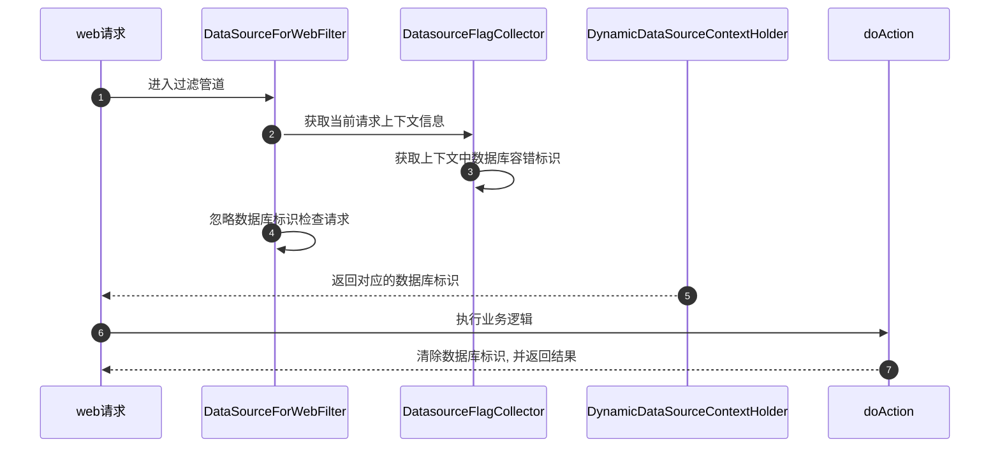
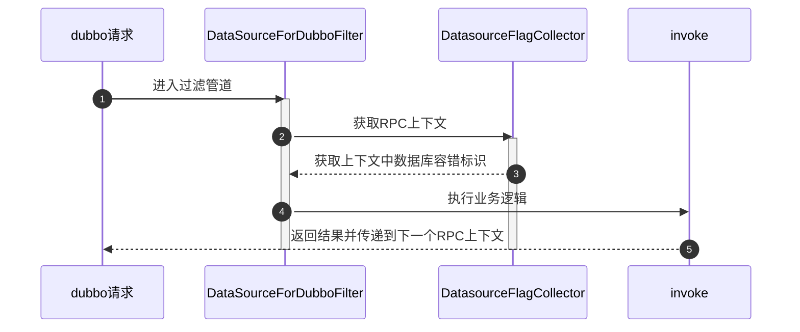

# 统一业务2.0基础框架
## 数据操作
### 简单增删改查
1. 创建实体类
```java
// @Entity注解的实体类将会被JPA管理控制，在程序运行时，JPA会识别并映射到指定的数据库表
// 唯一参数name:指定实体类名称，默认为当前实体类的非限定名称。
// 若给了name属性值即@Entity(name="XXX")，则jpa在仓储层(数据层)进行自定义查询时，所查的表名应是XXX。
// 如：select s from XXX s
// 也可以使用@Table(name = "t_booK")标注该实体类对应的表名，@Entity注解中不用再加name属性
@Data
@ToString
@Entity(name = "t_book")
public class Book {
    @Id
    @GeneratedValue(strategy = GenerationType.IDENTITY)
    private Integer id;
    @Column(name = "book_name",nullable = false)
    private String name;
    private String author;
    private Float price;
    
    // @Transient注解：生成数据表时该属性被忽略
    @Transient
    private String description;
}
```

2. 创建repository相关接口继承CustomizedRepository

```java
/**
 * 自定义BookDao继承CustomizedRepository，CustomizedRepository提供了一些基本的数据操作方法，有基本的增删改查，  分页，排序等方法
 CustomizedRepository<Book,Integer>中第一个参数为对应的实体类，第二个参数是对应实体类中的主键的类型
 */
@Transactional // 开启事务
public interface BookDao extends CustomizedRepository<Book,Integer>{
    // 自定义查询方法1：通过方法命名进行查询（查询作者姓名以某个字符开始的书籍）
    List<Book> getBooksByAuthorStartingWith(String author);
    
    // 自定义查询方法2：通过方法命名进行查询（查询单价大于某个值的书籍）
    List<Book> getBooksByPriceGreaterThan(Float price);
    
    // 自定义查询方法3：通过原生sql语句查询（查询id最大的书籍）
    // springdata jpa也支持自定义JPQL或原生SQL，nativeQuery = true表示使用原生SQL查询
    // 原生SQL就是说，sql语句中的表名、字段名都是使用数据库中所定义的属性，而不是实体类的属性
    @Query(value = "select * from t_book where id=(select max(id) from t_book)",nativeQuery = true)
    Book getMaxIdBook();
    
    // 自定义查询方法4：通过JPQL语句查询（根据id和author进行查询），这里默认使用的是JPQL语句；JPQL通过类名和对象属性访问，而不是表名和表的属性，这里的表名是t_book是因为在Book实体类中使用@Entity(name = "t_book")注解指定了表名
    @Query("select b from t_book b where b.id>:id and b.author=:author")
    List<Book> getBookByIdAndAuthor(@Param("author") String author, @Param("id") Integer id);
    
    // 自定义查询方法5：通过JPQL语句查询（根据id和书名进行查询）
    @Query("select b from t_book b where b.id<?2 and b.name like %?1%")
    List<Book> getBooksByIdAndName(String name, Integer id);
    
    // 注：如果BookDao中自定义的方法涉及到修改、删除操作，就要添加@Modifying注解并添加事务注解@Transactional
    // 修改
    @Modifying
    @Query("update t_book b set b.name = :name where b.id = :id")
    int modifyByName(@Param("name") String name ,@Param("id") Integer id);
    
    // 删除
    @Modifying
    @Query("delete from t_book b where b.id = ?1")
    int deleteBook(Integer id);
}
```


3. 创建BookService(为了简便这里直接创建类，不创建接口)

```java
@Service
public class BookService {
    @Autowired
    BookDao bookDao;
    
    // 保存单个实体
    public Book addBook(Book book) {
        // 使用save方法将对象数据保存到了数据表中，save方法是由CustomizedRepository接口提供的
        return bookDao.save(book);
    }

    // 保存多个实体
    public List<Book> addBooks(Iterable<Book> books) {
        return bookDao.saveAll(books);
    }
    
    public Page<Book> getBookByPage(Pageable pageable) {
        // 分页查询，使用findAll方法，返回值为Page<Book>,该对象中包含分页常用数据，例如总记录数，总页数，每页记录数，当前页记录数等
        return bookDao.findAll(pageable);
    }
    
    public List<Book> getBooksByAuthorStartingWith(String author){
        return bookDao.getBooksByAuthorStartingWith(author);
    }
    
    public List<Book> getBooksByPriceGreaterThan(Float price){
        return bookDao.getBooksByPriceGreaterThan(price);
    }
    
    public Book getMaxIdBook(){
        return bookDao.getMaxIdBook();
    }
    
    public List<Book> getBookByIdAndAuthor(String author, Integer id){
        return bookDao.getBookByIdAndAuthor(author, id);
    }
    
    public List<Book> getBooksByIdAndName(String name, Integer id){
        return bookDao.getBooksByIdAndName(name, id);
    }
    
    public int modifyByName(String name, Integer id) {
        return bookDao.modifyByName(name, id);
    }
    
    public int deleteBook(Integer id) {
        return bookDao.deleteBook(id);
    }
}
```

4. 创建BookController,实现对数据的测试

```java
@RestController
public class BookController {
    @Autowired
    BookService bookService;
    
    @GetMapping("/findAll")
    public void findAll() {
        // 首先通过PageRequest中的of方法构造PageRequest对象，of方法接受两个参数，第一个参数是页数从0开始，第二个参数是每页显示条数
        PageRequest pageable = PageRequest.of(2, 3);
        Page<Book> page = bookService.getBookByPage(pageable);
        System.out.println("总页数:"+page.getTotalPages());
        System.out.println("总记录数:"+page.getTotalElements());
        System.out.println("查询结果:"+page.getContent());
        System.out.println("当前页数:"+(page.getNumber()+1));
        System.out.println("当前页记录数:"+page.getNumberOfElements());
        System.out.println("每页记录数:"+page.getSize());
    }
    
    @GetMapping("/search")
    public void search() {
        List<Book> bs1 = bookService.getBookByIdAndAuthor("曹雪芹", 7);
        List<Book> bs2 = bookService.getBooksByAuthorStartingWith("吴");
        List<Book> bs3 = bookService.getBooksByIdAndName("西", 8);
        List<Book> bs4 = bookService.getBooksByPriceGreaterThan(30F);
        Book b = bookService.getMaxIdBook();
        System.out.println("bs1:"+bs1);
        System.out.println("bs2:"+bs2);
        System.out.println("bs3:"+bs3);
        System.out.println("bs4:"+bs4);
        System.out.println("b:"+b);
    }
    
    @PostMapping("/save")
    public Book save() {
        Book book = new Book();
        book.setAuthor("曹雪芹");
        book.setName("红楼梦");
        book.setPrice(23F);
        return bookService.addBook(book);
    }
    
    @PostMapping("/saveAll")
    public List<Book> saveAll() {
        List<Book> list = new ArrayList<>();
        Book book1 = new Book();
        book1.setAuthor("老子");
        book1.setName("道德经");
        book1.setPrice(200F);
        
        Book book2 = new Book();
        book2.setAuthor("周文王");
        book2.setName("易经");
        book2.setPrice(200F);
        list.add(book1);
        list.add(book2);
        
        return bookService.addBooks(list);
    }
    
    @PutMapping("/update")
    public void updateBook() {
        String name = "彷徨";
        Integer id = 1;
        int res = bookService.modifyByName(name, 1);
        System.out.println(res);
    }

    @DeleteMapping("/delete")
    public void deleteBook() {
        Integer id = 1;
        int res = bookService.deleteBook(id);
        System.out.println(res);
    }
}

```

### 查询方法命名规则

1. 简单条件查询

简单条件查询：查询某一个实体类或者集合。
 按照Spring Data的规范的规定，查询方法以find | read | get开头（比如 find、findBy、read、readBy、get、getBy），涉及查询条件时，条件的属性用条件关键字连接，要注意的是：条件属性以首字母大写。框架在进行方法名解析时，会先把方法名多余的前缀截取掉，然后对剩下部分进行解析。
 直接在接口中定义查询方法，如果是符合规范的，可以不用写实现，即不用写SQL，目前支持的关键字写法如下：

| 关键字            | **SQL符号**         | 方法命名                    | sql where字句              |
| ----------------- | ------------------- | --------------------------- | -------------------------- |
| And               | and                 | findByNameAndPwd            | where name= ? and pwd =?   |
| Or                | or                  | findByNameOrSex             | where name= ? or sex=?     |
| Is,Equals         | =                   | findById,findByIdEquals     | where id= ?                |
| Between           | between xx and xx   | findByIdBetween             | where id between ? and ?   |
| LessThan          | <                   | findByIdLessThan            | where id < ?               |
| LessThanEquals    | <=                  | findByIdLessThanEquals      | where id <= ?              |
| GreaterThan       | >                   | findByIdGreaterThan         | where id > ?               |
| GreaterThanEquals | >=                  | findByIdGreaterThanEquals   | where id > = ?             |
| After             | >                   | findByIdAfter               | where id > ?               |
| Before            | <                   | findByIdBefore              | where id < ?               |
| IsNull            | is null             | findByNameIsNull            | where name is null         |
| isNotNull,NotNull | is not null         | findByNameNotNull           | where name is not null     |
| Like              | like                | findByNameLike              | where name like ?          |
| NotLike           | not like            | findByNameNotLike           | where name not like ?      |
| StartingWith      | like 'xxx%'         | findByNameStartingWith      | where name like '?%'       |
| EndingWith        | like 'xxx%'         | findByNameEndingWith        | where name like '%?'       |
| Containing        | like '%xxx%'        | findByNameContaining        | where name like '%?%'      |
| OrderBy           | order by            | findByIdOrderByXDesc        | where id=? order by x desc |
| Not               | <>                  | findByNameNot               | where name <> ?            |
| In                | in()                | findByIdIn(Collection<?> c) | where id in (?)            |
| NotIn             | not in()            | findByNameNot               | where name <> ?            |
| True              | =true               | findByAaaTue                | where aaa = true           |
| False             | =false              | findByAaaFalse              | where aaa = false          |
| IgnoreCase        | upper(xx)=upper(yy) | findByNameIgnoreCase        | where UPPER(name)=UPPER(?) |


2. 查询方法解析流程

假如我们创建如下的查询：findByUserDepUuid(),框架在解析该方法时，首先剔除findBy，然后对剩下的属性进行解析，假设查询实体为Doc。

1. 先判断userDepUuid (根据POJO（Plain Ordinary Java Object简单java对象，实际就是普通java bean）规范，首字母变为小写。)是否是查询实体的一个属性，如果根据该属性进行查询；如果没有该属性，继续第二步。
2. 从右往左截取第一个大写字母开头的字符串(此处为Uuid)，然后检查剩下的字符串是否为查询实体的一个属性，如果是，则表示根据该属性进行查询；如果没有该属性，则重复第二步，继续从右往左截取；最后假设 user为查询实体的一个属性。
3. 接着处理剩下部分（DepUuid），先判断user所对应的类型是否有depUuid属性，如果有，则表示该方法最终是根据 “Doc.user.depUuid” 的取值进行查询；否则继续按照步骤 2的规则从右往左截取，最终表示根据“Doc.user.dep.uuid” 的值进行查询。
4. 可能会存在一种特殊情况，比如 Doc包含一个user的属性，也有一个 userDep 属性，此时会存在混淆。可以明确在属性之间加上 "_"以显式表达意图，比如"findByUser_DepUuid()" 或者"findByUserDep_uuid()"。

   

3. 命名规则不适合动态查询

当查询条件为null时，如
- 实体定义：对于一个客户实体Cus,包含有name和gender，均是String类型。
- 查询方法定义：`List<Cus> findByNameAndGender(String name,String gender);`
- 使用时：`dao.findByNameAndGender(null, "男");`
- 后台生成sql片断：`where (cus0_.name is null) and cus0_.gender=?`

!> 当查询时传值是null时，数据库中只有该字段是null的记录才符合条件，并不是说忽略这个条件。也就是说，这种查询方式，只适合于明确查询条件必须传的业务，对于动态查询（条件多少是动态的，例如一般的查询列表，由最终用户使用时决定输入那些查询条件），这种简单查询是不能满足要求的。
命名规则也不适合delete  insert  update.   只适合简单查询

### 使用查询对象查询

1. #### 单表查询

1.1 在`application/filter`包下定义查询实体（按userID和userName查询为例）

```java
@Data
@FilterEntity(rootEntity = User.class)
@NoArgsConstructor
@AllArgsConstructor
public class QuerySimple {

    @Filter(operator = Operator.EQ)
    private String userId;

    @Filter(operator = Operator.EQ)
    private String userName;
}
```

1.2 创建实体仓库

```java
public interface UserRepository extends CustomizedRepository<User, String> {
}
```

1.3 创建查询对象，设置查询参数，执行查询
```java
var filter = new QuerySimple();
filter.setUserId(id);
filter.setUserName(name);
var list = userRepository.queryWithFilterE(filter);
```
!> 如果在创建查询对象时并未对查询字段赋值，那么在执行查询对象时，会将未赋值的字段过滤掉。    
如下所示，对照上面的例子，在创建对象时，并未对userName赋值，那么在执行时，userName会被过滤，即在where条件中不会包含userName：

```java
var filter = new QuerySimple();
filter.setUserId(id);
var list = userRepository.queryWithFilterE(filter);
```

2. 分页

执行查询时，调用queryPageWithFilterE()方法

```java
var filter = new QuerySimple();
filter.setUnitId("1");
Pagination<QuerySimple> list = userRepository.queryPageWithFilterE(filter,PageRequest.of(0,2));
```

3. 根据时间查询

定义查询实体,在实体中定义时间类型的字段

```java
@Filter(operator = Operator.EQ)
@Temporal(TemporalType.DATE)
private Date birthday;
```

创建查询对象，执行查询

```java
var filter  = new QueryDate();
filter.setBirthday(new Date());
var list = userRepository.queryWithFilterE(filter);
```

4. 根据范围查询

!> 需添加无参和包含查询字段的构造函数，且需要定义最小值和最大值。如例所示

```java
public QueryRange() {
}

public QueryRange(Date birthday) {
    this.birthday = birthday;
}

@Filter(operator = Operator.BETWEEN)
private Date birthday;

@JsonIgnore
private Date birthday_Max;
@JsonIgnore
private Date birthday_Min;
```

2. #### 多表查询

!>  以`user、unit、city`三张表为例,此方式要满足关联的表要有相同的字段（此例中，`user`与`unit`以`unitId`关联，`unit`与`city`以`cityId`关联）

2.1  添加过来条件

```java
@Filter(operator = Operator.EQ)
private String userId;

@Filter(joinFrom= Unit.class,joinType = JoinType.LEFT_JOIN,target = Unit.class)
private String unitId;

@Filter(joinFrom = City.class,joinTo = Unit.class,joinType = JoinType.LEFT_JOIN,target = City.class,inWhere = false)
private String cityId;
```

2.2  实现使用两表中不同的字段进行关联查询，使用以下方式

```java
@Filter(joinFrom = City.class,on = "cityId")
private String userId;
```

2.3 有多个关联条件

```java
@Filter(joinFrom= Unit.class,on = "unitId")
private String userId;

@Filter(joinFrom = Unit.class,on = "unitName")
private String userName;
```

2.4 `on`条件使用传入的值

```java
@Filter(joinFrom= Unit.class,joinType = JoinType.LEFT_JOIN,onOperator = Operator.EQ,inOn = true,target = Unit.class)
private String unitId;
```

2.5 `动态条件拼接`

!> 条件中绑定了值的字段，需要设置查询对象中对应字段的`@Filter`属性`isExtend=true`

```java
userRepository.queryWithFilterE(filter,(filter)->{
    String whereCon = "";
    String dzcx = filter.getDzcx();
    if ("0".equals(dzcx)){
        1 = whereCon.concat(" AND user.dwbm = :dwbm ");
        if (StringUtils.isNotBlank(filter.getDzdwbm())){
            whereCon = whereCon.concat(" AND user.dzdwbm =:dzdwbm ");
        }else {
            whereCon = whereCon.concat(" AND user.dzdwbm =:dwbm ");
        }
    }else if("1".equals(dzcx)){
        whereCon = whereCon.concat(" AND user.dzdwbm =:dwbm ");
    }
    return whereCon;
});
```

2.6 `Filter`参数说明

|参数|类型|默认值|说明|
|-|-|-|-|
|propertyName|String|空字符|字段名|
|isAnd|boolean|true|where条件的连接关键字，为true时表示and,为false时表示or|
|isSelect|boolean|true|是否作为查询字段|
|joinFrom|Class|Object.class|关联表|
|joinType|JoinType|JoinType.INNER_JOIN|join方式|
|joinTo|Class|Object.class|被关联的表|
|on|String|空字符|关联的字段|
|onTo|String|空字符|被关联的字段|
|operator|Operator|Operator.EQ|where条件的运算方式|
|target|Class|Object.class|目标类|
|targetProp|String|空字符|目标字段|
|inWhere|boolean|true|是否作为where条件|
|isExtend|boolean|false|是否作为扩展字段|
|whereGroup|String|空字符|定义字段在where条件中属于哪一个group|
|whereGroupIsAnd|boolean|true|where条件中，连接group的关键字，为true时表示and,为false时表示or|
|inOn|boolean|false|是否作为on条件|
|onOperator|Operator|Operator.EQ|on条件的运算方式|
|order|int|0|join顺序，由小到大|


2.7 `Operator`参数说明

|参数|含义|
|-|-|
|EQ|=|
|NEQ|!=|
|GT|>|
|GTE|>=|
|LT|<|
|LTE|<=|
|NULL|IS NULL|
|BETWEEN|BETWEEN|
|LIKE|LIKE|
|NOT|NOT|4
|IN|IN|
|NOT_NULL|IS NOT NULL|

### 局部更新及软删除

> 扩展新增修改添加部分字段更新及软删除更新的支持

```java
/**
  * 新增
  * @param entity
  * @param <S>
  * @return
  */
insert(S entity);

/**
  * 更新
  * @param entity
  * @param <S>
  * @return
  */
update(S entity);

/**
  * 新增或者修改
  * @param entity
  * @param <S>
  * @return
  */
insertOrUpdate(S entity);

/**
  * 更新部分字段
  * @param entity 更新对象（映射字段与实体对象一致）
  * @apiNote 更新主键字段需要使用@UpdateId 注解标注
  */
update(Object entity, Class<T> entityType);

/**
  * 更新部分字段
  * @param entity 更新对象（映射字段与实体对象一致）
  * @apiNote 更新主键字段需要使用@UpdateId 注解标注
  */
updateIgnoreNull(Object entity, Class<T> entityType);

/**
  * 软删除
  * @param idPropName 主键对应属性名称
  * @param idValue 主键对应属性值
  * @param entityType 实体类型
  * @apiNote 更新主键字段需要使用@UpdateId 注解标注
  */
softDelete(String idPropName, Object idValue, Class<T> entityType);

/**
  * 软删除
  * @param entity 普通删除Dto对象
  * @param entityType 实体类型
  */
softDelete(Object entity, Class<T> entityType);

/**
  * 软删除
  * @param entity 普通删除对象
  * @param entityType 实体类型
  */
softDeleteWithAnyId(Object entity, Class<T> entityType);

/**
  * 按照条件对象查询
  * @param queryFilter
  * @return 查询结果
  */
queryWithFilterE(S queryFilter);

/**
  * 按照条件对象查询
  * @param queryFilter
  * @return
  */
queryPageWithFilterE(S queryFilter, PageRequest pageRequest);

/**
  * 按照JPQL模板查询
  * @param entity
  * @return
  */
queryWithTemplate(String tplName, String method, Object entity, Class<S> resultType);

/**
  * 按照JPQL模板分页查询
  * @param entity
  * @return
  */
queryPageWithTemplate(String tplName, String method,  Object entity,Class<S> resultType, PageRequest pageRequest);

/**
  * 按照原生SQL模板查询
  * @param entity
  * @return
  */
nativeQueryWithTemplate( String tplName, String method, Object entity,Class<S> resultType);

/**
  * 按照原生SQL模板分页查询
  * @param entity
  * @return
  */
nativeQueryWithTemplate(String tplName, String method, Object entity,Class<S> resultType, PageRequest pageRequest);
```

3.2 使用示例

```java
public interface UserRepository extends CustomizedRepository<User,String> {}

# 应用入口添加以下注解

@EnableSimpleJpaRepositories
public class DemoApplication{

}
```

### 复合主键处理
> 假设我们之前用到的`Blog`示例中，需要使用 `title`和 `url`作为复合主键，我们就需要创建以下类

```java
@Data
public class BlogKey implements Serializable {
    private String title;
    private String url;
}
```

然后我们在对`Blog`实体类加上`@IdClass`注解就可以,这里需要注意的是两个主键都需要加`@Id`注解

```java
@Data
@Entity
@IdClass(BlogKey.class)
@EqualsAndHashCode(callSuper = false)
public class Blog extends BaseAudited {
    @GeneratedValue(strategy = GenerationType.IDENTITY)
    @Column(name ="id", nullable = false)
    private int blogId;

    @Id
    @Column(name = "title", nullable = false, length = 50)
    private String title ;

    @Id
    @Column(name = "url", nullable = false, length = 150)
    private String url;

    @OneToMany(mappedBy ="blog",cascade=CascadeType.ALL,fetch=FetchType.LAZY)
    private List<Post> posts ;

    public void addPost(Post post){
        this.getPosts().add(post);
    }
}
```
- ID生成策略

> JPA提供四种标准用法,由`@GeneratedValue`的源代码可以明显看出.

JPA提供的`GenerationType`四种标准用法为`TABLE`,`SEQUENCE`,`IDENTITY`,`AUTO`.

1. `TABLE`：使用一个特定的数据库表格来保存主键。
1. `SEQUENCE`：根据底层数据库的序列来生成主键，条件是数据库支持序列。
1. `IDENTITY`：主键由数据库自动生成（主要是自动增长型）
1. `AUTO`：主键由程序控制(也是默认的,在指定主键时，如果不指定主键生成策略，默认为AUTO)

- 常见数据库的支持情况如下
| &emsp;&emsp;&emsp;&emsp;&emsp;&emsp;数据库&emsp;&emsp;&emsp;&emsp;&emsp;&emsp;|&emsp;&emsp;&emsp;&emsp;&emsp;&emsp;支持项&emsp;&emsp;&emsp;&emsp;&emsp;&emsp; |
| ------------   | ------------|
|*MYSQL*| `GenerationType.TABLE`<br> `GenerationType.AUTO`<br> `GenerationType.IDENTITY`<br> ~~`GenerationType.SEQUENCE`~~<br>|
|*ORACLE*|`GenerationType.TABLE`<br> `GenerationType.AUTO`<br>~~`GenerationType.IDENTITY`<br>~~ `GenerationType.SEQUENCE`<br>|

- 使用方法

在我们的应用中，一般选用`@GeneratedValue(strategy=GenerationType.AUTO)`这种方式，自动选择主键生成策略，以适应不同的数据库移植。也可以使用`Hibernate`对主键生成策略的扩展，通过`Hibernate`的`@GenericGenerator`实现。即

```java
@Id
@GeneratedValue
private String id;
```

> 下面使我们正在使用一个例子

```java
@Id
  // 声明一个策略通用生成器，name为"system-uuid",策略strategy为"uuid"
@GenericGenerator(name = "system-uuid", strategy = "uuid")
  // 用generator属性指定要使用的策略生成器
@GeneratedValue(generator = "system-uuid")
@Column(name = "log_id")
private String id;
```
这是`Log`模型使用的一种方式，生成32位的字符串，适用于所有数据库。

- 如何进行部分字段查询
?> `JPA`为此提供了三种解决方案，但是考虑到`最少知识` 原则，直接复用`Dto`即可

```java
public BlogTitlesOnlyDto {
    private String title;
    public BlogTitlesOnlyDto(String title) {
        this.title = title;
    }
    ...
}
```

使用也很简单  

```java
public interface BlogRepository extends CrudRepository<Blog,Integer> {
    List<BlogTitlesOnlyDto> findAllByTitle(String title); 
}

```
> 但是这个场景好像只是拿到很单一的结果`BlogTitlesOnlyDto`，谁知道未知场景下程序员要什么结果，其实我们也可以返回一个泛型对象，只要稍加改动

```java
public interface BlogRepository extends CrudRepository<Blog,Integer> {
   <T> List<T> findAllByTitle(String title, Class<T> clazz); 
}
```

这样你依旧可以用

```java
  List<Blog> blogs = repository.findAllByTitle(Blog.class);
```


## 优雅停机
> 最新版本的`springboot`本身已经支持优雅停机，本版本只适用于统一业务
### 场景说明
当我们流量请求到某个接口执行业务逻辑的时候，若服务端此时执行停止服务 （kill），spring boot 默认情况会立即关闭容器（tomcat 等），导致此业务逻辑执行失败。在一些业务场景下, 会出现数据不一致的情况，事务逻辑不会回滚。改功能默认的添加了功能监控检查 默认访问 http://localhost:port/actuator/health， 会在k8s/edas的健康检查节点添加如下监控信息
```js
{
"status": "UP",
"details": {
"gracefulShutdown": {
"status": "UP",
"details": {
      "description": "是否开启优雅，空或者UP则为开启"
      }
    }
  }
}
```


### 配置说明
1. `graceful.shutdown.enabled=true`  
是否开启优雅关机
2. `graceful.shutdown.wait=30s`  
等待用户线程执行结束的缓冲时间

## 接口文档生成
> 自动生成文档功能是集成swagger-ui的功能，因此一切注释生成语法都与swagger-ui的保持一致。

### 配置说明

> 不添加任何swagger配置也可以使用
```properties
application.swagger.title=演示文档
application.swagger.enable = true
application.swagger.description=进行非查询操作请在 header 添加 USER-ID 参数
application.swagger.version=1.0.0.RELEASE
application.swagger.contact.name=维护人/团队
application.swagger.contact.url=维护人URL
application.swagger.contact.email=维护人email
application.swagger.base-path=/api/**  #这个配置要求所有的api接口都必须以`api`开头才能全部获取到
application.swagger.exclude-path=/error
```

### 扩展说明
> 用户可以自定义实现`SwaggerReader`接口来扩展`Swagger`在线文档的显示效果

`SwaggerReader`接口说明

| 方法                | 入参                                                         | 返回值       | 备注                                  |
| ------------------- | ------------------------------------------------------------ | ------------ | ------------------------------------- |
| `listed`            | @param `path` 请求路径 <br>@param `description` 描述 <br/>@param `requestMethod` 请求方式 | Boolean      | 改路径的接口是否swagger清单中展示     |
| `listTryItOutPaths` | --                                                           | List<String> | 获取所有Swagger中可使用测试按钮的路径 |


### 使用示例
!> 必须添加`@ApiOperation`注解才可以显示接口文档信息

```java
@GetMapping("/api/users")
@ApiOperation(
  value = "获取所有用户", 
  notes = "备注说明,这里只是测试Post方式并且添加自动验证功能"
)
public  ResponseResult  users() {
    // todo
}
```

3. `@ApiModel`为接口出入参对象添加说明

```java
@ApiModel("模型")
public class DemoInputDTO implements InputDTO<Demo> {
}
```

4. `@ApiModelProperty`为借口出入参对象的字段添加说明

```java
@ApiModel("模型")
public class DemoInputDTO implements InputDTO<Demo> {
  @ApiModelProperty("内容")
  public String content;
}
```

## Tomcat临时文件清理
### 配置说明
1. `application.tomcat.auto-clean=true`  
是否自动清理tomcat临时文件
2. `application.tomcat.clean-corn=*/12 * * * * ?`  
定时清理的`cron`表达式

!> 注意: 当配置上述参数后,必须指定`server.tomcat.basedir`的值,该参数详细解释请看springboot相关资料


## CORS
### 配置说明
1. `application.cors.path-pattern`      
可选。设置允许跨域的接口地址，默认`/**`代表所有地址
2. `application.cors.origins`    
可选。表示接受任意域名的请求, 默认是 `*`
3. `application.cors.methods`    
可选。(重要)设置允许跨域的请求方式，例如:GET,POST,PUT等，多个以逗号分隔，`*`代表允许所有的请求方法，默认：GET,HEAD,POST
4. `application.cors.headers`    
可选。配置`Access-Control-Expose-Headers`, 此属性不支持`*`，默认不设置
5. `application.cors.credentials`    
可选。配置`Access-Control-Allow-Credentials`, 默认true

## 多数据源支持
 
### 多元数据库Web请求设计

### 多元数据库Dubbo请求设计


### 关键类说明

1. `DynamicDataSourceRegister` 动态数据源注册器，用于组装和配置数据源
2. `DynamicDataSourceContextHolder` 动态设置当前数据源和动态获取当前数据源

### 配置说明
1. `application.datasource.list`  
 部署点单位标识列表，当 `application.datasource.support-multi-deployment=true`时候除`default`以外的所有数据源会自动再后面追加`_read/_write`后缀 
 其中 `default`为必选数据源 
 例如: 以下实际上是配置了5个数据源，即 `default,370000_read,370000_write,100000_read,100000_write`
```properties
application.datasource.list=default,370000,100000
# 实际上等价于
application.datasource.list=default,370000_read,370000_write,100000_read,100000_write
application.datasource.support-multi-deployment=false
```
2. `application.datasource.support-multi-deployment`  
开启多数据源部署模式  
3. `application.datasource.if-absent-use-default=true`   
当数据库标识丢失后是否使用缺省值 `default`  
4. `appliation.skip-check-db-urls`  
用于在项目启动过程中将某些请求跳过数据库标识检查


> 以下是一个完整的多数据源配置示例
```properties

# 默认数据源
spring.datasource.driver-class-name=dm.jdbc.driver.DmDriver
spring.datasource.url=xxxxxxxxxxxxxxxxxxxxxxxxxxxxxxx
spring.datasource.password=123456
spring.datasource.username=root

# 部署点370000数据源
spring.datasource.370000_read.driver-class-name=dm.jdbc.driver.DmDriver
spring.datasource.370000_read.url=xxxxxxxxxxxxxxxxxxxxxxxxxxxxxxx
spring.datasource.370000_read.password=123456
spring.datasource.370000_read.username=root

spring.datasource.370000_write.driver-class-name=dm.jdbc.driver.DmDriver
spring.datasource.370000_write.url=xxxxxxxxxxxxxxxxxxxxxxxxxxxxxxx
spring.datasource.370000_write.password=123456
spring.datasource.370000_write.username=root

# 部署点10000数据源
spring.datasource.100000_read.driver-class-name=dm.jdbc.driver.DmDriver
spring.datasource.100000_read.url=xxxxxxxxxxxxxxxxxxxxxxxxxxxxxxx
spring.datasource.100000_read.password=123456
spring.datasource.100000_read.username=root

spring.datasource.100000_write.driver-class-name=dm.jdbc.driver.DmDriver
spring.datasource.100000_write.url=xxxxxxxxxxxxxxxxxxxxxxxxxxxxxxx
spring.datasource.100000_write.password=123456
spring.datasource.100000_write.username=root

# 部署点单位标识,与之前版本配置一致，不过不需要写read/write后缀
application.datasource.list=default,370000,100000
# 开启多部署点开关，false后上述配置全部和工作网使用一致，以上配置将作废
application.datasource.support-multi-deployment=true
#专网为fasle,工作网为true
application.datasource.if-absent-use-default=true
```


!> 注意事项

- 约定每个部署点数据源都有读写库，都以`_read/_write`结尾， 大小写敏感
- 整个请求周期内用户上下文的信息都可以通过`UserInfoManager` 对象的`getUserInfo`方法获取到，一般情况下均为自动维护
- 上步获取到的对象的`getBsdsjkbs`方法可获取部署点数据库类型，该方法在非多源模式下不允许调用，调用将收到“运行时异常”，另外如果传入的发布单位编码没有匹配到对应的存储，方法也会报错找不到对象；
